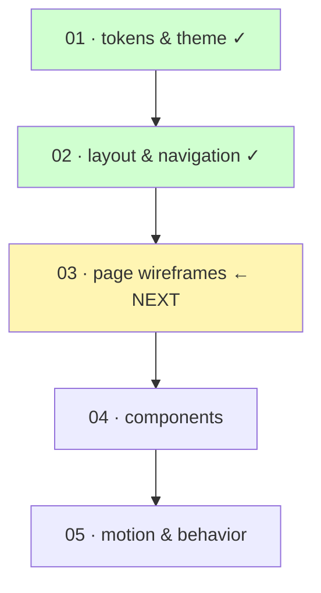

# Handoff — design-system brainstorm pause (2026-05-14)

Pick up the design-system + UI/UX work here. The earlier phase-1 (dep upgrade) handoff at [`./phase-1-followup-2026-05-13.md`](./phase-1-followup-2026-05-13.md) is **still open** — those changes are also uncommitted in the working tree.

## What scope this brainstorm covers

User chose to **skip phase 2 of the original roadmap** (backend code structure / zod cleanup / eslint+prettier port) for now and jump straight to design-system + UI/UX work. Original phases 2–4 will be revisited later.

Brainstorm decomposition (each its own stable doc + brainstorm session):



## Done in this session

### Stable docs landed

- [`docs/stable/_shared/design/01-tokens-and-theme.md`](../../stable/_shared/design/01-tokens-and-theme.md) — color/type/spacing/radius/elevation/motion/z-index/breakpoints, dark+light parity, AA/AAA contrast notes, semantic dot-hierarchy naming, `data-theme` switching.
- [`docs/stable/_shared/design/02-layout-and-navigation.md`](../../stable/_shared/design/02-layout-and-navigation.md) — shell anatomy, pinnable icon-rail sidebar, mobile bottom nav + drawer, ⌘K command palette, GitLab-style detail panel (inline + dedicated route), handedness preference with desktop-mirror opt-in, breakpoint behavior matrix, keyboard shortcuts, a11y notes.

### Mockups (in repo, not committed)

Live under `.superpowers/brainstorm/22044-1778775633/content/`:

- `palette-direction.html` — 3 palette directions (A confirmed direction + B/C tweaks)
- `light-states.html` — 3 light-mode state-color variants (option 3 "muted" picked)
- `typography-character.html` — 4 type characters (A "geometric modern" picked)
- `composite-tokens.html` — palette + type + density + radius + shadow assembled together
- `layout-shell.html` — initial 3 desktop layouts (A/B/C) + mobile + ⌘K
- `layout-shell-v2.html` — final layout: B+A hybrid (pinnable rail), handedness-aware mobile, settings preview

`.superpowers/` should be in `.gitignore`. If not yet, add it before any commit — these files persist in-repo so the visual session can be resumed across sessions, but they don't belong in version control.

## Locked design decisions (so far)

### Color (from spec 01)

- Dark base `#0F0F13`, light base `#F8F7F9`
- Primary accent: violet — dark stop `#C084FC`, light stop `#7C3AED`
- Secondary accent: cyan, sparing — dark `#67E8F9`, light `#0E7490`
- Dark states: vivid (`#F87171` / `#FBBF24` / `#34D399`)
- Light states: muted/desaturated (`#BE3A47` / `#A86528` / `#3E7C50`)
- AA minimum, AAA for body text

### Typography

- Character: geometric modern (Inter-style stand-in; specific font picked at impl time)
- 10-step scale anchored at 14px body
- Mono pairing for IDs/dates/code

### Other tokens

- Spacing: 4px base, 13 named steps
- Radius: xs 4 / sm 6 / md 8 / lg 12 / xl 16 / 2xl 20 / full
- Elevation: 5-shadow scale incl. accent-tinted glow for primary CTAs
- Density: medium baseline; 44px touch-target floor on mobile
- Naming: semantic dot-hierarchy CSS custom properties, no prefix
- Theme switching via `<html data-theme="…">` attribute, system-mode via media query

### Layout (from spec 02)

- Desktop: pinnable icon-rail (56px collapsed default ↔ 220px pinned)
- Mobile: bottom nav 5 slots (Today / Cal / **+ FAB** / Projects / Inbox) + drawer
- Command palette ⌘K universal; mobile uses full-screen sheet variant
- Detail panel: GitLab-style — query-param-driven inline panel (right edge desktop, bottom sheet mobile) + dedicated route with same component
- Handedness preference: applies to mobile by default; opt-in "Apply to desktop too" mirrors sidebar AND flips detail panel to opposite edge

## Visual companion server

Was running on **http://localhost:54777** during this session. The server auto-exits after 30 minutes of inactivity, so it's likely **dead by the time you resume**.

To resume the same session (mockups persist):

```bash
/home/ducky/.claude/plugins/cache/claude-plugins-official/superpowers/5.1.0/skills/brainstorming/scripts/start-server.sh \
  --project-dir /home/ducky/repos/duckycoding/task_manager
```

The server picks up the existing `.superpowers/brainstorm/22044-1778775633/` directory automatically. Returned JSON has the new URL + port (will likely be different).

To start fresh (new session id, old mockups stay in place but aren't surfaced):

```bash
# same command; it creates a new timestamped session dir under .superpowers/brainstorm/
```

## Uncommitted state

This brainstorm session added:

- `docs/stable/_shared/design/01-tokens-and-theme.md` (new)
- `docs/stable/_shared/design/02-layout-and-navigation.md` (new)
- `docs/handoffs/_shared/design-system-brainstorm-2026-05-14.md` (this file)
- `.superpowers/brainstorm/22044-…` mockup directory (should be .gitignored, not committed)

Earlier phase-1 work that's also still uncommitted (covered in `phase-1-followup-2026-05-13.md`):

- Dep bumps across 9 groups (root + backend package.json) + the eslint-10 follow-up that bumped 4 react19 plugins
- `apps/backend/src/index.ts`, `apps/backend/src/utils/logger.ts`, `apps/backend/tsconfig.json` adjustments forced by `@types/bun` 1.3.14 and TS 6.0.3
- `docs/stable/_shared/dependency-upgrades-2026-05.md` (new)
- `docs/stable/backend/zod-schemas.md` (refreshed; outdated flag removed)
- `CLAUDE.md` (root, link annotation updated)

Suggested commit grouping for design work (you commit when ready):

```
docs(design): add tokens & theme spec (01)
docs(design): add layout & navigation spec (02)
docs(handoffs): design-system brainstorm pause point
chore(gitignore): ignore .superpowers/ brainstorm artifacts
```

Phase-1 commits separately, per the prior handoff.

## Resume checklist

1. Open this file + `phase-1-followup-2026-05-13.md`.
2. Skim `docs/stable/_shared/design/01-tokens-and-theme.md` and `02-layout-and-navigation.md` to refresh on locked decisions.
3. Add `.superpowers/` to `.gitignore` if not yet done.
4. (Optional) Restart the visual-companion server — command above.
5. Continue with spec 03 (page wireframes) — see scope below.

## Scope for spec 03 — page wireframes (NEXT)

Target file: `docs/stable/_shared/design/03-page-wireframes.md`.

### Pages to design

Mapped to backend resources. Each gets a wireframe (desktop + mobile) and an information-architecture write-up. **No** component-level pixel specs — those live in 04.

| Page | Backend touchpoint | Notes |
|---|---|---|
| Dashboard / Today | `GET /tasks?dueDate=today` + `GET /reminders?dueSoon` | Default landing. Recap: today's tasks, overdue, due-soon, quick-add |
| Calendar | `GET /tasks` filtered by date range + `GET /reminders` | Month/week/day views; click date → list of that day; click task → detail panel |
| Inbox | `GET /reminders` + notification stream (eventually) | Reminders fired/upcoming, system notifications, snooze actions |
| All tasks | `GET /tasks` w/ filters | List + filter bar; saved filter views; sorting; bulk actions |
| Projects (list) | `GET /projects` | Card grid or list; color-dot; counts; "+ new project" |
| Project page | `GET /projects/:id` + `GET /tasks?projectId=:id` | Default tab = Board (kanban). Tabs: Board · Tasks (list) · Reminders. Detail panel still works |
| Task detail (panel + page) | `GET /tasks/:id`, mutations | Title, description (markdown?), status, priority, due, recurring, project, labels, reminders, activity log |
| Labels | `GET /labels` | List + manage colors + assignable count per label |
| Settings | n/a (preferences) | Layout/display (handedness, sidebar, theme), Account, Notifications |
| Auth (login / signup / reset) | BetterAuth `/auth/*` | Standalone shell — no main app chrome |

### Open questions to resolve in spec 03

- Dashboard composition: which widgets, default order, can the user reorder? (User mentioned "maybe the user could decide" — defer to v1.5 or include from v1?)
- Calendar default view: month / week / day on first load? Mobile fallback.
- Quick-add task form shape: top-of-list inline input, modal, or slide-down? (Mobile FAB triggers what exactly?)
- All-tasks: filter persistence (URL query vs preference) and saved-filter feature scope.
- Kanban: column set = `todo / in_progress / done` per backend status enum. Are columns hardcoded or configurable per project? (Recommend hardcoded v1, matches backend enum.)
- Task detail content blocks: which fields are always visible vs collapsed, where activity-log lives, how comments work (does the backend have them? — check; otherwise out of scope).
- Recurring tasks UX: backend has a `recurring` config — surface how on the task detail page.
- Empty states for every list page.
- Skeleton/loading states (token-level hints from spec 01 — repeat-fade should be defined here per surface).

### Backend reality check before drafting spec 03

Verify against `apps/backend/src/features/*/*.types.ts` and the live OpenAPI at `http://localhost:3001/docs` (when running):

- Projects: confirmed user-owned via `users_projects` table — likely not shareable v1. Spec 03 should NOT design sharing UX.
- Labels: many-to-many via `task_labels`. Per-user labels? Verify.
- Reminders: linked to a task AND a user. Per-task reminder list UI is fine.
- Comments / activity log / attachments: NOT in the schema today. If you want them in 03, that's a backend-additions checklist for a later phase.

If a wireframe in 03 needs a backend capability that doesn't exist, mark it explicitly as "🟡 needs backend work" — don't pretend it's free.

## Carry-forward followups from phase 1 (still open)

From `phase-1-followup-2026-05-13.md`:

- `apps/backend/tsconfig.json`: remove `baseUrl`, verify `paths` still resolves, drop the `ignoreDeprecations` shim before TS 7.
- Redundant `extendZodWithOpenApi(z)` lines in 4 `*.types.ts` files.
- Schema-sharing architecture (move pure zod schemas to a shared package).
- `apps/react19` non-eslint deps + `packages/utils` deps still pending.
- 8 react-refresh warnings on tanstack-router route files (config tweak or per-file disable).

These are NOT part of the design brainstorm; they're code work for a later pass.

## Open user-context items (session memory, do not commit to repo)

- User is leaning **Vue/Nuxt** as the next frontend; `apps/react19` may not be continued past minimal upkeep.
- User has a "newer project" with eslint/prettier/zod patterns that should be ported when phases 2–4 of the original roadmap resume.
- User pauses brainstorms by saying "I have to go" / "let's pause" — write a handoff doc with state + next steps, no commits unless explicitly asked.
