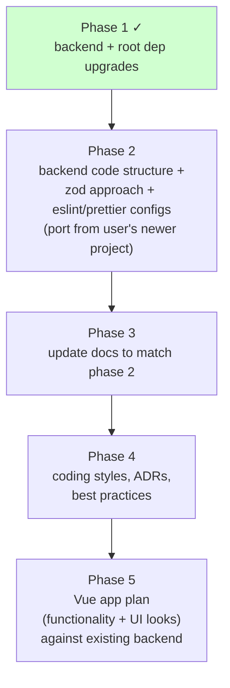

# Handoff — phase-1 + follow-ups (2026-05-13)

Pick up tomorrow from here. Phase 1 of the user's roadmap landed; all work is uncommitted in the working tree. The user wanted to review commits manually rather than letting the agent commit.

## Done in this session

### Phase 1 — backend + root dep upgrades (9 groups)

Full details in [`../../stable/_shared/dependency-upgrades-2026-05.md`](../../stable/_shared/dependency-upgrades-2026-05.md). One-line summary:

| # | Group | Result |
|---|---|---|
| 1 | husky / lint-staged | `lint-staged` 16.2.3 → 17.0.4 (husky already latest) |
| 2 | prettier | 3.6.2 → 3.8.3 |
| 3 | eslint stack — minor parts | `typescript-eslint` 8.45 → 8.59, `globals` 16 → 17 (eslint itself stayed on 9 in this group; see follow-up below) |
| 4 | BetterAuth | 1.3.24 → 1.6.11 |
| 5 | clsx + tailwind-merge + drop cva | `tailwind-merge` 3.3.1 → 3.6.0; `cva` removed (unused) |
| 6 | postgres driver | 3.4.7 → 3.4.9 |
| 7 | hono stack | `hono` 4.11 → 4.12.18, `@hono/zod-validator` 0.7.5 → 0.8.0, `@hono/zod-openapi` 1.1.5 → 1.4.0, `@scalar/hono-api-reference` 0.9.28 → 0.10.14. **Side benefit: fixed the duplicate-zod tsc errors (161 → 0).** |
| 8 | zod + drizzle trio | `zod` 4.2.1 → 4.4.3, `drizzle-orm` 0.45.1 → 0.45.2, `drizzle-kit` 0.31.8 → 0.31.10 |
| 9 | TypeScript + @types/bun | `typescript` 5.9.3 → 6.0.3, `@types/bun` 1.3.4 → 1.3.14 |

### Follow-up: eslint 10 unblocked

After bumping `apps/react19` devDeps (`@eslint-react/eslint-plugin` 2.0.4 → 5.7.7, `eslint-plugin-react-hooks` 5 → 7.1.1, `eslint-plugin-react-refresh` 0.4 → 0.5.2, `@tanstack/eslint-plugin-query` 5.91 → 5.100.10), the root `eslint` + `@eslint/js` could move to 10.3.0 / 10.0.1.

### Code touched (forced by `@types/bun` 1.3.14)

- `apps/backend/src/index.ts` — `import type { Serve } from 'bun'` removed; `satisfies Serve` → `satisfies Bun.Serve.Options<undefined>`.
- `apps/backend/src/utils/logger.ts` — `log/info/warn/error/debug` signatures changed from `(...args: Parameters<typeof console.X>)` to explicit `(message: string, ...args: unknown[])` (new console types don't spread cleanly into `logLogic`).
- `apps/backend/tsconfig.json` — added `"ignoreDeprecations": "6.0"` to silence TS 6 `baseUrl` warning. **Must be cleaned up before TS 7** (remove `baseUrl`, verify `paths` still resolves).

### Documentation work

- New: `docs/stable/_shared/dependency-upgrades-2026-05.md` — version table, API shifts, deferrals, verification.
- Refreshed: `docs/stable/backend/zod-schemas.md` — outdated flag dropped, accurate current pattern documented with mermaid diagrams, redundant `extendZodWithOpenApi(z)` flagged, latent frontend-bundle issue captured.
- Updated: root `CLAUDE.md` — drop the `⚠ unverified, may be outdated` qualifier on the `zod-schemas.md` link; bump `updated:` to 2026-05-14.

## Uncommitted state — suggested commit boundaries

User reviews each. Order roughly follows the verify-gate order.

```
chore(deps): bump lint-staged to 17.0.4
chore(deps): bump prettier to 3.8.3
chore(deps): bump typescript-eslint + globals (eslint 10 deferred during this step)
chore(deps): bump better-auth to 1.6.11
chore(deps): bump tailwind-merge to 3.6.0, drop unused cva
chore(deps): bump postgres to 3.4.9
chore(deps): bump hono stack (hono 4.12.18 / @hono/zod-openapi 1.4 / scalar 0.10.14) — fixes duplicate-zod type errors
chore(deps): bump zod 4.4.3 + drizzle (orm 0.45.2 + kit 0.31.10)
chore(deps): bump typescript 6.0.3 + @types/bun 1.3.14
   - includes apps/backend/src/index.ts (Serve → Bun.Serve.Options)
   - includes apps/backend/src/utils/logger.ts (explicit signatures)
   - includes apps/backend/tsconfig.json (ignoreDeprecations 6.0)
chore(deps): bump react19 eslint plugins (@eslint-react 5.7.7, react-hooks 7.1.1, react-refresh 0.5.2, tanstack-query 5.100.10)
chore(deps): bump eslint to 10.3.0 + @eslint/js 10.0.1
docs: add dependency-upgrades-2026-05 stable doc
docs: refresh zod-schemas.md + drop outdated flag in root CLAUDE.md
```

Alternative: fold the last two `docs:` lines into a single commit. User's call.

## Verification snapshot at end of session

- `bun install` clean.
- `bunx tsc -p apps/backend/tsconfig.json --noEmit` → 0 errors.
- `bunx eslint apps/backend/src/**/*.ts` → 0 errors, 2 warnings (unused `eslint-disable` directives).
- `bunx eslint apps/react19/src/**/*.{ts,tsx}` → 0 errors, 8 warnings (`react-refresh/only-export-components` on tanstack route files — expected pattern).
- Backend boots on `PORT=3091`; `/docs`, `/reference`, `/auth/get-session` → 200; `/tasks`, `/labels`, `/projects`, `/reminders` → 401 (auth gate, expected unauthenticated).

## Next-up roadmap (user's stated phases)

User defined this order at the start of phase 1; phase 1 + a sliver of phase 2 (eslint deps) are done.



## Known follow-ups carried into phase 2+

1. **`apps/backend/tsconfig.json`**: remove `baseUrl`, verify `paths: { "*/": ["./src/*"] }` still resolves without it, drop the `ignoreDeprecations` shim. Must happen before TS 7.
2. **Redundant `extendZodWithOpenApi(z)` lines** in 4 files: `apps/backend/src/features/{labels,reminders,tasks,projects}/*.types.ts`. Either delete and keep `zod/v4` imports, or swap to the rexport `z from '@hono/zod-openapi'`. Either is fine — both produce identical runtime behavior. See [`docs/stable/backend/zod-schemas.md`](../../stable/backend/zod-schemas.md).
3. **Schema-sharing architecture**: if a frontend ever wants to value-import zod schemas from backend (not just type-only), schemas need to move to a package that doesn't import drizzle or `@hono/zod-openapi`. Today's `import type { Task } from '@task-manager/backend/tasks'` pattern in react19 is fine; value imports would drag both into the bundle. See the diagram in `zod-schemas.md`.
4. **Pending dep work**: `apps/react19` runtime deps (react, tanstack-router/query, tailwind, daisyui, vite, etc.) and `packages/utils` deps are still pending. Out of phase 1 scope; revisit if/when react19 is actively worked on. Note user is leaning Vue (see open user-context below) so react19 dep upkeep is low priority.
5. **ESLint warnings to revisit**:
   - Backend: 2 unused `eslint-disable` directives — can be cleaned with `--fix`.
   - React19: 8 `react-refresh/only-export-components` warnings on tanstack-router route files exporting `Route` alongside the component. May need an ESLint override for route files, or a config tweak to allow that specific export pattern.

## Open user-context items (do not put into repo docs)

These are session memory, kept out of committed docs per the user's preference:

- User is leaning toward **Vue** as the next frontend exploration. `apps/react19` may not be continued past minimal upkeep.
- User has a **"newer project"** with eslint/prettier/zod patterns to port into this repo during phase 2. Surface this at the start of the phase-2 session — request that the user share/point at those configs first.

## How to resume tomorrow

1. **Read this handoff first.** Optionally read the stable doc at `docs/stable/_shared/dependency-upgrades-2026-05.md` for full version table + verification.
2. **Decide on commits**: review the diff, commit using the boundaries above (or merge as preferred). Push if desired.
3. **Start phase 2**:
   - Ask the user to share the eslint/prettier/zod patterns from their newer project.
   - Plan the porting work with a new brainstorming/plan session — likely a fresh plan file.
   - Reference the carry-forward items above when scoping.
