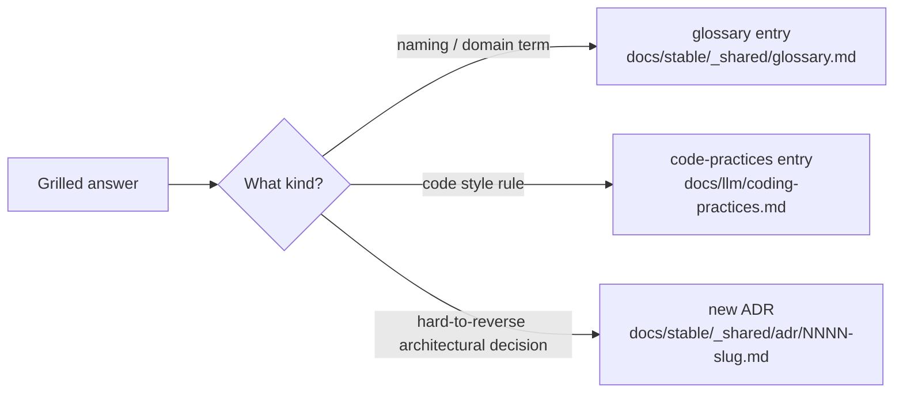

# Agent behavior rules

This file is the editable surface for *how* LLM agents should work in this repo. It's linked from the root [CLAUDE.md](../../CLAUDE.md) — agents read it before doing substantive work.

The `docs/llm/` folder is reserved for LLM-meta docs; expect more files here over time (e.g. `coding-practices.md`).

## Communication style

- Be synthetic. Skip preambles, summaries-of-summaries, and conversation filler.
- Be objective. Don't tell the user they're right unless it's objectively true. Challenge assumptions when there's reason to.
- Don't narrate thought processes. Plans and design rationale belong in plan files, not in every chat reply. Explain reasoning when asked.
- Reference code by `path:line` when possible.

## Diagrams

Always use mermaid syntax for graphs. Never use ASCII-art diagrams.

## Clarifying questions

Ask follow-up questions when the topic is not fully defined. Don't guess large requirements. Small details where the right answer is obvious from the codebase don't need a question — but anything that determines design or scope does.

## Git & destructive actions

- Never run `git` commands unless the user explicitly asks or pre-authorizes.
- Same caution applies to other destructive/irreversible actions: `rm -rf` outside the workspace, force-push, dropping DB tables, etc.
- When in doubt, stop and ask.

## Planning

When a non-trivial task needs planning, write a plan file:

- Location: `docs/plans/<feature>/<slug>.md` — or `docs/plans/_shared/<slug>.md` for cross-cutting work.
- Body shape: Context (why), target outcome (what), step checklist using `- [ ]` / `- [x]`, references to existing files/code.
- Update the checkboxes as steps complete — keep the plan as the source of truth for in-progress work.
- Required frontmatter (see below).

## Handoffs

If work stops with anything incomplete, write a handoff file:

- Location: `docs/handoffs/<feature>/<slug>.md`.
- Body shape: what was done, what remains, current state of files/branches, the immediate next step, traps the next agent should know about.
- Lifecycle: handoff stays until the related plan completes; then it's deleted alongside the plan.

## Plan completion

When the work in a plan is fully done:

1. Delete the plan file.
2. Delete any related handoff files.
3. Create or update a **stable** doc at `docs/stable/<feature>/<slug>.md` capturing the durable knowledge produced by the work (architecture decisions, conventions established, gotchas).

This way `docs/plans/` and `docs/handoffs/` only ever show active work; `docs/stable/` is the long-term knowledge base.

## Feature buckets

Use these `<feature>` segments inside `docs/plans/`, `docs/handoffs/`, `docs/stable/`:

- Backend domain features: `tasks`, `projects`, `labels`, `reminders`, `auth` (match `apps/backend/src/features/*`).
- Backend-wide topics that aren't a single domain feature: `backend`.
- Frontend-specific: `react19` (and future `vue`, `next`, etc.).
- Monorepo-wide / cross-cutting: `_shared`.
- New buckets are fine when a new app or domain shows up.

## App-internal docs

`apps/<app>/docs/` and `packages/<pkg>/docs/` hold tool guides and gotchas relevant only to that workspace (e.g. `apps/react19/docs/daisyui.md`).

**Promotion rule:** when a second workspace adopts a tool/library whose doc currently lives under one app, move the doc to `docs/stable/_shared/<tool>.md` and update links from the consuming CLAUDE.md files. Don't duplicate.

App-internal docs are flat — they do not get their own `plans/`/`handoffs/`/`stable/` subtree. Plans and handoffs always live at the root `docs/`.

## Frontmatter contract

Every `.md` under `docs/`, every `apps/<app>/docs/*.md`, and every `CLAUDE.md` carries frontmatter:

```yaml
---
created: YYYY-MM-DD
updated: YYYY-MM-DD
summary: <one-line description of contents>
---
```

- `created` is set once and never changes.
- `updated` must be bumped on every meaningful edit. Trivial typo fixes don't need a bump.
- `summary` is one descriptive line — it's what shows up in search/listing scripts and helps future agents decide whether to read the file.

## Grill-with-me · terminology discipline

The project keeps a living glossary at [`docs/stable/_shared/glossary.md`](../stable/_shared/glossary.md). It records every domain term, concept, and entity in the app — definitions, aliases-to-avoid, examples, and cross-links between related entries. Treat it as authoritative.

**Trigger**: any time, during conversation or while reading the codebase, you encounter a name that

- isn't in the glossary,
- is in the glossary but is being used with a different meaning,
- has two competing names ("label" vs "tag", "reminder" vs "alarm", `isCompleted` vs `done`),
- is vague enough that a future agent would have to ask what it means,

…**stop and surface it**. Grill the user. Don't move on with the ambiguity unresolved.

### Scope: this is NOT just prose terminology

The protocol covers every identifier and convention the project uses, in any artifact:

- **Domain language** in chat, design docs, plans, handoffs, spec text.
- **Code-level names**: field names on a schema, variables, function/method names, route segments, query-param keys, env vars, file/folder names, exported symbol names, type/interface names, CSS class names, design-token names, table/column names, enum members.
- **Code style**: function form (`function foo()` vs `const foo = () =>`), casing (camel / Pascal / kebab / snake), export style (named vs default), import order, error-handling pattern (throw vs Result), type-vs-interface, comment density, file structure, single vs split responsibilities, hook/composable conventions.

A `recurringInterval` field, a `getActiveTasks()` function, a `useTaskStatus` hook, a `--color-bg-surface` token, a `/tasks/:taskId` route segment, a coexistence of `function foo()` and `const foo = () =>` for similar purposes — all of these are subject to the protocol. If any of them is inconsistent, ambiguous, or unrecorded, grill until it's resolved.

### Output channels — three records to maintain

A grilled-out answer gets recorded in one of three places depending on what kind of decision it is:



Picking the right channel:

| Kind of answer | Channel |
|---|---|
| Canonical name for an entity / field / concept / function / variable. | [`glossary.md`](../stable/_shared/glossary.md) |
| Rule that says "in this codebase, code is written like X, not like Y" — mechanical, easy to mass-update, evolves continuously. | [`coding-practices.md`](./coding-practices.md) |
| Decision that is hard to reverse, surprising without context, and was a real trade-off. | New [ADR](../stable/_shared/adr/README.md) under `docs/stable/_shared/adr/`. |

Edge cases:

- A style rule that *traces back to* an architectural decision: record the rule in `coding-practices.md`, cross-link to the ADR that originated it.
- A naming choice that *implements* an architectural decision: record the term in the glossary, cross-link to the ADR.
- When in doubt between coding-practices and ADR, apply Pocock's three criteria (hard to reverse · surprising without context · real trade-off). All three true → ADR. Otherwise → coding-practices.

### The grill loop

1. **Flag clearly.** Quote where you saw it (`path:line` for code), what's ambiguous, new, or inconsistent.
2. **Propose a working definition / pick** based on context, marked as a guess. For style rules, offer 2–3 candidates the user can pick from.
3. **Interview the user**: name, scope, relationships to other entries, valid aliases vs forbidden ones, examples of usage. **There is no question cap** — grill until both of you could write the same definition / rule unprompted. Stop only when it's perfectly clear; never settle for "good enough".
4. **Record it in the right channel** — glossary, coding-practices, or ADR (see output channels above). Bump `updated:` on the touched doc. Cross-link related entries with markdown links. For code-level names, the glossary entry should pin the canonical identifier (e.g. "the entity is **Task**; the table is `tasks`; the type is `Task`; the field encoding recurrence is `recurringInterval`").
5. **Use the canonical name / pattern going forward** — in conversation AND in any code/docs/configs you touch. If you slip and use a forbidden alias or write code that contradicts a recorded practice, the user can call you on it.

### Examples of grill-worthy moments

- Codebase has `tasks.recurringInterval` enum but design docs say "recurrence". Are those interchangeable? Aliases need to be noted in the glossary.
- A new feature mentions "snooze" — noun, verb, both? Does it have implications on backend state?
- Schema has a `notifications` table planned and a `reminders` table existing. Glossary must clearly separate the two so they don't get conflated.
- "Deleted items view" — one per entity, or one combined? Decision goes in the glossary.
- A new helper is proposed as `markComplete(task)` vs `completeTask(task)` vs `toggleStatus(task, 'done')`. Pick one (grill on it) and record the chosen verb form so all future code matches.
- A new query param `?priority=high` vs `?prio=high` vs `?p=high`. Even short aliases get grilled.

### Style

- Relentless but cheap on words. Caveman mode applies — fragmented questions are fine. Don't pad.
- Multiple unclear names in a single message: list them; let the user answer in any order.
- It's fine to defer one ambiguity if pursuing another first, but never silently drop one.
- When grilling about a code-level name, prefer offering 2–3 candidate spellings so the user can pick rather than having to invent from scratch.

### Grilling tactics

Four moves to use during the interview phase. These tighten the loop and prevent fuzzy answers from sneaking past.

#### 1 · Challenge against the glossary

When the user uses a term that **conflicts with an existing entry** in `glossary.md`, call it out immediately.

> "The glossary defines `reminder` as a timed notification tied to a task. You just used `reminder` to mean a system notification — which is it? Are we talking about [Reminder](../stable/_shared/glossary.md#reminder) or a new concept (Notification)?"

Never silently absorb a redefinition — the glossary is authoritative until the user updates it.

#### 2 · Sharpen fuzzy language

When the user uses **vague or overloaded** terms, propose a precise canonical term + ask which they mean.

> "You said 'list'. Do you mean the [All tasks](../stable/_shared/glossary.md#all-tasks) page, the [List view mode](../stable/_shared/glossary.md#view-mode) of a project, or the task-row list component? Pick one."

The fuzzier the term, the more candidates to offer. Force precision before moving on.

#### 3 · Discuss concrete scenarios

When domain relationships are being designed or revisited, **stress-test them with invented scenarios**. Probe edge cases that force the user to be precise about boundaries.

> "A user soft-deletes a reminder. The parent task is then hard-deleted via FK cascade — what happens to the soft-deleted reminder's `taskId`? Cascade should fire, right? Confirm the row vanishes (or doesn't)."
>
> "A label is soft-deleted via 'keep task links'. Then the user permanently deletes it from the deleted-labels view. Do the lingering `task_labels` rows cascade? Confirm the FK is `ON DELETE CASCADE`."

Edge cases shake out implicit assumptions that comfortable abstract discussions hide.

#### 4 · Cross-reference with code

When the user states **how something works**, check whether the code actually agrees. Contradictions get surfaced immediately.

> "You said 'tasks have no project required'. The schema in `apps/backend/src/features/tasks/tasks.db.ts:18` declares `projectId` as nullable — that matches. ✓"
>
> "You said 'reminders can be standalone'. The schema in `apps/backend/src/features/reminders/reminders.db.ts:13` declares `taskId` as `NOT NULL`. Contradiction — which is right? Update the schema, or update the doc?"

This catches drift between design intent and current code. Both directions are valid — the question is which one updates.

## Plan/handoff cleanup discipline

- A merged feature whose plan still exists is a bug — delete the plan, create the stable doc.
- A stable doc with no matching feature in the code is a bug — verify or delete.
- If you find leftover plans or handoffs whose work is clearly done, surface them to the user before deleting.
