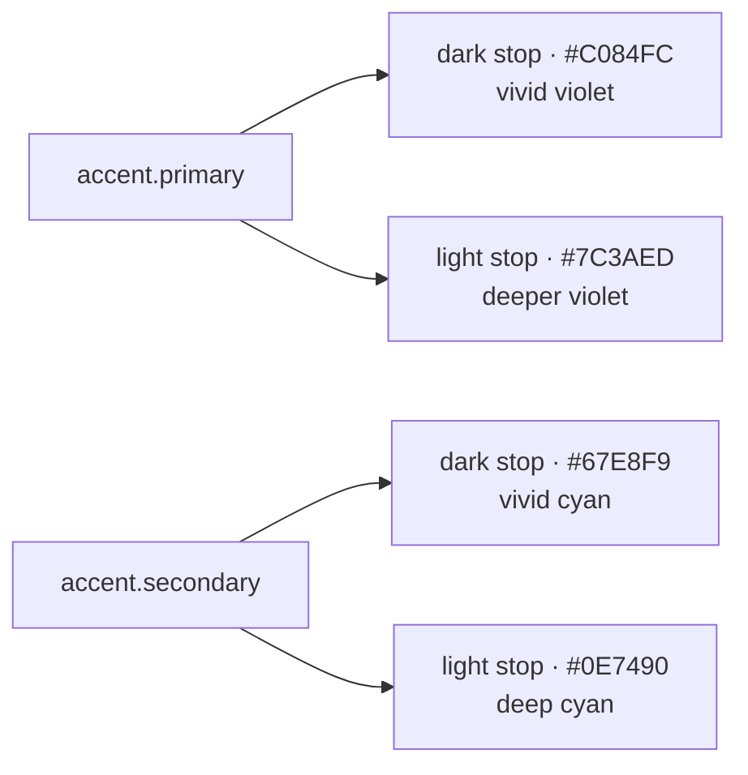

# Design tokens & theme

First doc in the design-system bucket. Covers the **values**, not the components. Components, page wireframes, and motion design live in sibling docs (`02-…`, `03-…`).

This system targets a Vue/Nuxt frontend first but is intentionally framework-agnostic — every token is a raw CSS custom property. Anything Tailwind, Pinia, or styling-lib specific is **out of scope** here and belongs in the implementation phase.

## Principles

1. **Two modes, one identity.** Light and dark are equal citizens. Same hue family, different stops.
2. **Restraint over decoration.** One primary accent, one supporting accent, neutrals do most of the work.
3. **Accessibility is a token, not a checkbox.** Every color pair has a recorded contrast ratio. Defaults pass WCAG AA; body text passes AAA where possible.
4. **Mobile-first.** Touch targets ≥44px on mobile, density relaxes as the viewport grows.
5. **Semantic names beat literal names.** `--color-text-strong` survives a palette swap; `--color-gray-900` does not.

## Color

### Strategy

- A single hue family for the primary accent: violet.
- One supporting accent: cyan, used sparingly (info / links / decorative).
- Three semantic states: danger, warning, success.
- Mode parity via **dual stops** per role — a vivid stop for dark, a deeper stop for light. Same hue, different luminance.



### Raw values

#### Backgrounds & surfaces

| Token | Dark | Light | Notes |
|---|---|---|---|
| `--color-bg-base` | `#0F0F13` | `#F8F7F9` | Page background. Dark has subtle violet undertone, light is warm off-white. |
| `--color-bg-surface` | `#1A1A22` | `#FFFFFF` | Cards, dialogs, dropdowns. One step lifted from base. |
| `--color-bg-surface-raised` | `#22222E` | `#FFFFFF` | Popovers, command palette. Two steps lifted (dark only differs). |
| `--color-bg-overlay` | `rgba(0,0,0,0.6)` | `rgba(15,15,19,0.45)` | Modal backdrop. |
| `--color-bg-muted` | `#15151B` | `#F2F0F4` | Subtle area fills — table-zebra, callouts. |

#### Text

| Token | Dark | Light | Contrast on bg-base |
|---|---|---|---|
| `--color-text-strong` | `#E8E6EF` | `#1A1A22` | 14.5:1 / 16.2:1 — AAA body |
| `--color-text` | `#CFCAD9` | `#46444F` | 10.4:1 / 9.1:1 — AAA body |
| `--color-text-muted` | `#A8A5B5` | `#6B6770` | 6.9:1 / 5.6:1 — AA body |
| `--color-text-faint` | `#7A7787` | `#9B97A2` | 4.5:1 / 3.4:1 — AA large text only |
| `--color-text-on-accent` | `#0F0F13` | `#FFFFFF` | Text on `accent.primary` background. |

#### Borders

| Token | Dark | Light |
|---|---|---|
| `--color-border-subtle` | `#2A2A35` | `#ECE9EE` |
| `--color-border` | `#36364A` | `#DCD8E2` |
| `--color-border-strong` | `#4E4E66` | `#B9B3C3` |

#### Accents

| Token | Dark | Light | AA against bg-base |
|---|---|---|---|
| `--color-accent-primary` | `#C084FC` | `#7C3AED` | 8.1:1 / 5.7:1 — AAA / AA |
| `--color-accent-primary-hover` | `#CD9BFC` | `#6D28D9` | hover-state nudge |
| `--color-accent-primary-pressed` | `#A765E8` | `#5B21B6` | pressed-state |
| `--color-accent-primary-subtle` | `rgba(192,132,252,0.12)` | `rgba(124,58,237,0.10)` | tinted badge/chip bg |
| `--color-accent-secondary` | `#67E8F9` | `#0E7490` | 10.4:1 / 5.9:1 — AAA / AAA |
| `--color-accent-secondary-subtle` | `rgba(103,232,249,0.12)` | `rgba(14,116,144,0.10)` | tinted info chip |

#### Semantic states

Dark states stay vivid; light states are deliberately muted (chosen against brighter alternatives — "muddy" was the rejection cue) so they read as professional rather than alarming.

| Token | Dark | Light | AA against bg-base |
|---|---|---|---|
| `--color-state-danger` | `#F87171` | `#BE3A47` | 6.1:1 / 5.8:1 |
| `--color-state-warning` | `#FBBF24` | `#A86528` | 10.4:1 / 5.3:1 |
| `--color-state-success` | `#34D399` | `#3E7C50` | 7.4:1 / 5.0:1 |
| `--color-state-info` | `#67E8F9` | `#0E7490` | reuses `accent.secondary` |
| `--color-state-danger-subtle` | `rgba(248,113,113,0.12)` | `rgba(190,58,71,0.10)` | badge bg |
| `--color-state-warning-subtle` | `rgba(251,191,36,0.12)` | `rgba(168,101,40,0.10)` | badge bg |
| `--color-state-success-subtle` | `rgba(52,211,153,0.12)` | `rgba(62,124,80,0.10)` | badge bg |

#### Focus ring

| Token | Dark | Light |
|---|---|---|
| `--color-focus-ring` | `rgba(192,132,252,0.55)` | `rgba(124,58,237,0.45)` |

2px outer ring, 2px inner offset against background — design example in §Focus below.

### Contrast policy

- Body text: target **AAA (7:1)**. Strong + default tiers both clear it.
- Secondary/muted body text: minimum **AA (4.5:1)**.
- Faint text: AA-large (3:1) only — never use for body, only for hint-text-sized type ≥14px bold or ≥18px regular.
- Iconography and decorative elements: 3:1 minimum.
- Accent on backgrounds: every accent token has a confirmed pair (above).

### Color-blind sanity

Violet vs cyan: safe across deuteranopia, protanopia, tritanopia (violet ↔ blue-shift, cyan ↔ aqua-shift remain distinct from the warm states). Status states (red/amber/green) are the only at-risk trio — always pair color with an icon or label, never color-alone for state.

## Typography

Character: **geometric modern** — clean, neutral, slightly geometric letterforms; no display personality. Reads as "tool", not "magazine".

### Stacks

```css
--font-sans: <chosen geometric sans>, "Inter", system-ui, -apple-system, "Segoe UI", Roboto, sans-serif;
--font-mono: <chosen geometric mono>, "JetBrains Mono", ui-monospace, "SF Mono", "Cascadia Mono", Consolas, monospace;
```

Specific font family TBD at implementation time; the stack should always include `system-ui` as a graceful fallback.

### Type scale

8-step scale, modular ratio ≈ 1.2, anchored at 14px (body).

| Token | Size (rem / px) | Line-height | Weight | Letter-spacing | Use |
|---|---|---|---|---|---|
| `--type-display` | 2.5rem / 40 | 1.1 | 700 | -0.02em | Marketing/auth landing only |
| `--type-h1` | 2rem / 32 | 1.15 | 700 | -0.018em | Page titles |
| `--type-h2` | 1.5rem / 24 | 1.2 | 600 | -0.012em | Section headings |
| `--type-h3` | 1.25rem / 20 | 1.25 | 600 | -0.008em | Subsections |
| `--type-h4` | 1.0625rem / 17 | 1.3 | 600 | 0 | Card titles |
| `--type-body` | 0.875rem / 14 | 1.55 | 400 | 0 | Body, list items |
| `--type-body-strong` | 0.875rem / 14 | 1.55 | 500 | 0 | Body emphasis |
| `--type-small` | 0.75rem / 12 | 1.45 | 400 | 0 | Meta, captions |
| `--type-label` | 0.625rem / 10 | 1.3 | 600 | 0.12em (uppercase) | Section labels, eyebrow text |
| `--type-mono` | 0.75rem / 12 | 1.45 | 400 | 0 | IDs, dates, code |

Headings use `--font-sans`. `--type-mono` uses `--font-mono`. Numerals should use `font-variant-numeric: tabular-nums` in any table or list of numbers.

## Spacing

4px base unit. Multiplicative scale.

| Token | Value |
|---|---|
| `--space-0` | 0 |
| `--space-1` | 4px |
| `--space-2` | 8px |
| `--space-3` | 12px |
| `--space-4` | 16px |
| `--space-5` | 20px |
| `--space-6` | 24px |
| `--space-8` | 32px |
| `--space-10` | 40px |
| `--space-12` | 48px |
| `--space-16` | 64px |
| `--space-20` | 80px |
| `--space-24` | 96px |

## Radius

Modest, not pillowy. `full` reserved for avatars, pills, indicator dots.

| Token | Value | Use |
|---|---|---|
| `--radius-xs` | 4px | Tight inline chips, small inputs |
| `--radius-sm` | 6px | Badges, small buttons |
| `--radius-md` | 8px | Buttons, inputs, list rows |
| `--radius-lg` | 12px | Cards, dialogs, surfaces |
| `--radius-xl` | 16px | Hero / large surfaces |
| `--radius-2xl` | 20px | App shell containers |
| `--radius-full` | 9999px | Avatars, pills, status dots |

## Elevation (shadows)

Soft, layered. Not heavy material-style drop shadows. Primary CTAs in dark mode also carry a subtle accent-tinted glow.

| Token | Dark | Light |
|---|---|---|
| `--shadow-none` | `none` | `none` |
| `--shadow-card` | `0 1px 0 rgba(255,255,255,0.04), 0 8px 24px rgba(0,0,0,0.4)` | `0 1px 2px rgba(0,0,0,0.04), 0 8px 24px rgba(0,0,0,0.06)` |
| `--shadow-pop` | `0 12px 40px rgba(0,0,0,0.6)` | `0 12px 32px rgba(0,0,0,0.10)` |
| `--shadow-elevated` | `0 4px 14px rgba(192,132,252,0.25), 0 1px 2px rgba(0,0,0,0.5)` | `0 4px 14px rgba(124,58,237,0.25), 0 1px 2px rgba(0,0,0,0.05)` |
| `--shadow-focus-ring` | `0 0 0 2px var(--color-bg-base), 0 0 0 4px var(--color-focus-ring)` | same |

`--shadow-elevated` is the accent-tinted CTA glow. Use on primary buttons, FAB, top-of-stack dialogs only. Don't sprinkle.

## Motion

Tokens only — full motion design is a separate session.

| Token | Value | Use |
|---|---|---|
| `--ease-out` | `cubic-bezier(0.16, 1, 0.3, 1)` | Most enters: dialogs, menus, panel slide-in |
| `--ease-in` | `cubic-bezier(0.7, 0, 0.84, 0)` | Exits |
| `--ease-in-out` | `cubic-bezier(0.65, 0, 0.35, 1)` | Position/state transitions |
| `--ease-linear` | `linear` | Progress bars, spinners |
| `--duration-instant` | `80ms` | Tooltips, focus moves |
| `--duration-fast` | `150ms` | Hover, color changes, small UI feedback |
| `--duration-base` | `220ms` | Standard enter/exit, dialog open |
| `--duration-slow` | `360ms` | Sheet/drawer slide, large layout shifts |

Always respect `prefers-reduced-motion: reduce` — when set, durations collapse to `0ms` and easings become `linear`.

## Z-index

Ranges, not magic numbers. Use the named slot.

| Token | Value | Use |
|---|---|---|
| `--z-base` | 0 | Default flow |
| `--z-raised` | 10 | Sticky list headers |
| `--z-dropdown` | 30 | Menus, select |
| `--z-sticky-nav` | 40 | Top bar |
| `--z-overlay` | 50 | Modal backdrop |
| `--z-modal` | 60 | Dialog content |
| `--z-popover` | 70 | Popover, command palette |
| `--z-toast` | 80 | Toast notifications |
| `--z-tooltip` | 90 | Tooltip — highest |

## Breakpoints

Mobile-first. CSS-min-width queries.

| Token | Min-width | Notes |
|---|---|---|
| `--bp-sm` | 480px | Larger phones |
| `--bp-md` | 768px | Tablets / small laptops |
| `--bp-lg` | 1024px | Desktop, side-bar becomes persistent |
| `--bp-xl` | 1280px | Wide desktop |
| `--bp-2xl` | 1536px | Ultrawide |

Below `--bp-md`: bottom nav + togglable sidenav. ≥`--bp-lg`: persistent sidebar. Specific layout-shell behavior lives in `02-…`.

## Density

Single density set, with mobile touch-target floors enforced.

| Token | Value | Use |
|---|---|---|
| `--row-compact` | 40px | Toolbars, dense tables |
| `--row-default` | 48px | Most list items |
| `--row-comfortable` | 56px | Touch-first mobile list |
| `--touch-target-min` | 44px | Hard floor for any tappable element on mobile |

Default list rows scale: 40 on desktop, 48 on tablet, 56 on mobile (or 48 if touch density is set tighter via user preference — out of scope for v1).

## Naming convention

- Always **semantic**: `--color-bg-surface`, not `--color-gray-900`.
- Hierarchy via dot-style **read aloud**, kebab-case **on disk**: `color.bg.surface` ↔ `--color-bg-surface`.
- No prefix (`--ds-`, `--app-`) — the tokens live at the top level. If the project later embeds these inside another design system, the integration layer adds the prefix; tokens themselves stay clean.
- States append: `--color-accent-primary-hover`, `--color-accent-primary-pressed`, `--color-accent-primary-subtle`.
- Modes via attribute on `<html>`: `<html data-theme="dark">` / `<html data-theme="light">`. CSS toggles the value of every token in a single `[data-theme="dark"]` block. No JS-mediated color swapping at runtime beyond toggling that attribute.

## Theme switching strategy

Token shape stays the same; the **value** changes per mode.

```css
:root, [data-theme="light"] {
  --color-bg-base: #F8F7F9;
  --color-text-strong: #1A1A22;
  /* …all light tokens… */
}

[data-theme="dark"] {
  --color-bg-base: #0F0F13;
  --color-text-strong: #E8E6EF;
  /* …all dark tokens… */
}

@media (prefers-color-scheme: dark) {
  :root:not([data-theme]) {
    /* same as [data-theme="dark"] block */
  }
}
```

User preference > system preference. App stores the preference (localStorage or backend later). The `<html data-theme="…">` attribute is the single source of truth at runtime.

## Focus

- Every interactive element gets a visible focus ring: `--shadow-focus-ring`.
- Ring color = `--color-focus-ring` (violet-tinted, AA against both bgs).
- Never remove `outline`/focus styles without providing an equivalent.
- Use `:focus-visible` so mouse focus doesn't show the ring; keyboard focus always does.

## Accessibility checklist

- [x] All text tokens meet AA at default size; strong/default body tokens meet AAA.
- [x] Every state color has a non-color companion (icon or label) — to be enforced in component design.
- [x] Focus ring AA against both modes.
- [x] Motion respects `prefers-reduced-motion`.
- [ ] Reduced-transparency mode: not yet addressed (subtle bg overlays may need fallback). Add to component spec.
- [ ] High-contrast mode (`forced-colors`): not yet addressed. Add to component spec.

## CSS variable export — single source

All tokens live in one file at implementation time, e.g. `src/styles/tokens.css`. Components import nothing; they reference variables. The styling lib (Tailwind / vanilla / etc.) consumes this file via whatever bridge it offers — Tailwind via `@theme` or extend, vanilla CSS via direct usage, etc. This decision is post-spec.

## Out of scope (later docs)

- `02-layout-and-navigation.md` — app shell, top bar / sidebar / bottom nav / command palette.
- `03-page-wireframes.md` — dashboard, calendar, due-soon, all-tasks, kanban, task detail (panel + page).
- `04-components.md` — button variants, input states, dialogs, menus, toasts.
- `05-motion-and-behavior.md` — animation choreography, micro-interactions, drag-reorder, keyboard shortcuts.
