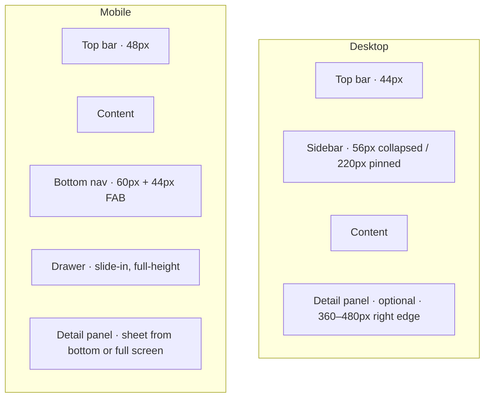

# Layout & navigation

Second doc in the design-system bucket. Defines the **shell** every page lives inside. Pages themselves (`03-page-wireframes.md`) and components (`04-components.md`) are separate.

Tokens referenced throughout are defined in [`01-tokens-and-theme.md`](./01-tokens-and-theme.md).

## Shell anatomy

Three persistent regions on desktop, two on mobile.

### Z-stacking

Top bar always on top of content (z-sticky-nav). Drawer/detail panel use z-modal/z-popover. Toast uses z-toast. Tooltip is highest.

## Top bar

### Desktop · 44px

| Slot (left → right) | Contents |
|---|---|
| Logo | App mark + wordmark. Click → Dashboard. |
| Search (inline) | 320–420px wide, placeholder "Search tasks, projects…", shows `⌘K` kbd on the right. Clicking it opens the command palette (same as ⌘K). |
| Flex spacer | Pushes right cluster to the edge. |
| Notifications | Bell icon. Badge dot when unread. Click → popover with recent notifications + "Open inbox" footer. |
| Theme toggle | Sun/moon icon. Click cycles system → light → dark. Long-press / dropdown reveals "Follow system". |
| Avatar / user menu | Initials/photo. Click → menu: profile, settings, sign out. |

Background: `--color-bg-surface`. Border-bottom: `--color-border-subtle`.

### Mobile · 48px

| Slot | Contents | Position depends on handedness pref |
|---|---|---|
| Page title | Current section name (replaces logo on mobile; logo only shows on auth/landing). | Always center-left |
| Search | ⌕ icon, opens command palette as a full-screen sheet | Right cluster |
| Theme | ☾ icon | Right cluster |
| Hamburger | ≡ icon, opens drawer | **Right by default**, left if user flipped preference |

If `handedness === 'left'`: hamburger moves to the left side of the top bar, drawer slides from left.

## Sidebar (desktop)

### Two states

**Collapsed** (default for new users) — 56px wide, icons only.

- Hover any item → tooltip with label + count.
- Click an item → navigates AND keeps sidebar collapsed.
- Pin button at top-right of rail (a small chevron `▶`) → expands and persists.

**Pinned** — 220px wide, labels + counts + section dividers.

- Pin button now `◀` → re-collapses.
- State stored under user preferences (`sidebarPinned: boolean`). Persists across devices via backend (eventually) or localStorage (v1).

### Navigation IA

Three sections, separated by uppercase section labels.

**Workspace**

- Dashboard (`▢`)
- Inbox (`⌖`) — count badge of unread/overdue
- Calendar (`▥`)
- All tasks (`≡`) — count badge of open tasks

**Projects**

- One row per project, color-dot prefix using the project's color.
- Expanded view (pinned only) reveals sub-items under the active project: Tasks list / Board / Reminders.
- `+ New project` row at the bottom of the section.

**More**

- Labels (`🏷`)
- Settings (`⚙`)

Footer pinned to the bottom of the sidebar (pinned state only): condensed user card + sign-out icon. Collapsed state: same info collapses to just the avatar.

### Active-state visuals

Active row uses `--color-accent-primary-subtle` background + `--color-accent-primary` text/icon. Inactive: `--color-text` text, `--color-text-muted` icon. Counts use `--color-bg-base` chip with `--color-text-muted` text.

## Bottom nav (mobile)

Five slots, fixed at the bottom edge, 60px tall above the safe-area inset.

| Slot | Icon | Label | Behavior |
|---|---|---|---|
| 1 | `▢` | Today | Dashboard |
| 2 | `▥` | Cal | Calendar |
| 3 | **FAB · +** | — | Floating action button, 44px, sits +22px above the bar (half-overlap). Opens "create task" quick form. Uses `--shadow-elevated` accent glow. |
| 4 | `▦` | Projects | Projects list |
| 5 | `⌖` | Inbox | Inbox |

Why this set: covers the four high-traffic destinations. **All tasks**, **Labels**, **Settings** live in the drawer — they're configuration/management, not daily navigation.

Active state: icon + label switch to `--color-accent-primary`. Inactive: `--color-text-faint` / `--color-text-muted`.

## Drawer (mobile)

Slides in from the **handedness-preference side** (right by default). Width: 86vw, max 320px.

Contents = the full sidebar IA from the desktop pinned state. Adds a sign-out row at the bottom. Closing: tap overlay, swipe away from the drawer side, or tap a nav item.

Animation: `--duration-base` with `--ease-out`. Respect reduced-motion.

## Command palette (⌘K / Ctrl+K)

Universal keyboard entry to navigation and actions.

### Trigger

- `⌘K` (mac) / `Ctrl+K` (everywhere else). Configurable later.
- Clicking the inline search slot in the top bar.
- Mobile: tapping the ⌕ icon opens a full-screen sheet variant.

### Behavior

- Modal positioned center-top (15vh from top), 520px wide, `--shadow-pop`, `--radius-lg`.
- Fuzzy search across: tasks (title, project, labels), projects, labels, settings actions, navigation routes.
- Empty input shows: **Recent tasks** (last 5) + **Quick actions** (Create task, Toggle theme, Open inbox).
- Results grouped under section labels (Tasks · Projects · Actions · Navigation).
- Arrow keys / ↑↓ navigate; Enter activates; Esc closes.
- Highlighted match: light bold of the matched substring.
- Action rows show keyboard shortcut chips (e.g. ⌘N for create task).

### Mobile sheet variant

- Full-screen overlay rather than centered modal.
- Search input pinned to the top with cancel button.
- Same result list below.
- Standard mobile keyboard behavior — no custom keyboard handling.

## Detail panel — GitLab-style

Tasks and reminders are viewable in two compatible modes:

1. **Inline panel** — opens over the right edge of the current content. Route updates to add `?task=<id>` query param. Content underneath is dimmed but visible. Closing removes the query param.
2. **Dedicated page** — direct route like `/tasks/:id`. Same component, same data, same actions. Inline panel includes an "Open full page" link in its header that navigates to the dedicated route.

### Panel mechanics

- Width: 360–480px. Resizable on desktop. Width preserved in user preferences.
- Slides in with `--duration-base` / `--ease-out`. Pushes nothing; just overlays content.
- Has its own scroll context.
- Backdrop: none on desktop (content stays clickable behind/beside the panel). Mobile sheet has a full backdrop.
- ESC closes. Browser back closes if the panel was the latest history entry.
- Multi-panel stacking is NOT supported v1 — opening a new task from within the panel replaces the current one.

### Handedness mirror (opt-in, desktop)

If user enabled "Apply to desktop too" with the handedness preference:

- Sidebar moves to the **chosen** side.
- Detail panel moves to the **opposite** side.
- Neither overlaps. Layout still has only one "edge widget" per side.

### Mobile behavior

- Tap a task in a list → bottom-sheet detail (full task UI).
- "Open full page" in the sheet header → dedicated route, replacing the sheet.
- Sheet uses 90vh max height, drag-down-to-close.

## Theme switching

- Three modes: `system` (default), `light`, `dark`.
- Stored as `theme` preference. `system` watches `prefers-color-scheme`.
- Top-bar toggle: short-click cycles through; long-press / chevron-dropdown gives explicit picker.
- Implementation: `<html data-theme="dark">` or `data-theme="light"`. When `system`, the attribute is removed and the media query block in tokens.css takes over.

## Notifications surface

Top-bar bell icon opens a **popover**, NOT a panel:

- 360px wide, `--shadow-pop`, `--radius-lg`.
- Latest 5–10 notifications.
- Each row: icon, short text, mono-timestamp, "View" link if applicable.
- Footer: "Open inbox" → navigates to `/inbox`.
- Unread dot on the bell when `unreadCount > 0`.

The full notification/reminder list lives at `/inbox` (separate page in spec 03).

## Breadcrumbs

- Desktop pinned sidebar: optional crumbs row above the page title on Project sub-pages (e.g. `Backend › Tasks › Today`).
- Desktop collapsed sidebar: crumbs row recommended on all pages with hierarchy (project context not visible in rail).
- Mobile: crumbs become the top-bar title text. Only deepest level shown; tap the title to surface a popover with full path.

## Breakpoint behavior

| Breakpoint | Sidebar | Top bar | Bottom nav | Detail panel |
|---|---|---|---|---|
| `< sm` (≤ 480) | Hidden, drawer-only | 48px mobile | Yes | Bottom sheet |
| `sm`–`md` (481–767) | Hidden, drawer-only | 48px mobile | Yes | Bottom sheet |
| `md`–`lg` (768–1023) | Hidden, drawer-only | 48px mobile + search slot | Yes | Bottom sheet or right-panel toggleable |
| `lg`–`xl` (1024–1279) | Visible, collapsed default | 44px desktop | No | Right panel |
| `≥ xl` (1280+) | Visible, pinned default | 44px desktop | No | Right panel, resizable |

Switching breakpoints is reactive — close the drawer if the user crosses the threshold; promote the bottom sheet to a panel; etc.

## Handedness preference — full rules

| Surface | Right-handed (default) | Left-handed | "Apply to desktop too" |
|---|---|---|---|
| Mobile hamburger | Top-right of top bar | Top-left of top bar | n/a |
| Mobile drawer slide-in | From right | From left | n/a |
| Desktop sidebar | Left edge | Left edge | Right edge if on |
| Desktop detail panel | Right edge | Right edge | Left edge if on |
| FAB (mobile) | Centered | Centered | n/a |

Mobile preference applies always. Desktop mirror is opt-in. The two sub-settings are independent.

## State persistence

Preferences persisted per-user:

- `theme`: `'system' | 'light' | 'dark'`
- `handedness`: `'left' | 'right'`
- `desktopMirrorEnabled`: `boolean`
- `sidebarPinned`: `boolean`
- `detailPanelWidth`: number (px)

V1 storage: localStorage keyed by user id. Backend sync (via a future `users/preferences` endpoint) deferred.

## Keyboard shortcuts (initial set)

| Shortcut | Action |
|---|---|
| `⌘K` / `Ctrl+K` | Open command palette |
| `⌘N` / `Ctrl+N` | New task (also FAB on mobile) |
| `g d` | Go to Dashboard |
| `g c` | Go to Calendar |
| `g i` | Go to Inbox |
| `g p` | Go to Projects |
| `g t` | Go to All tasks |
| `?` | Show keyboard-shortcut overlay |
| `Esc` | Close palette / panel / modal |
| `[` / `]` | Cycle through tasks in a list when a detail panel is open |
| `e` | Edit selected task |
| `c` | Complete / uncomplete selected task |

Full list lives in a help dialog accessible via `?`. Implementation: any keyboard library; spec-wise the bindings are what matter.

## A11y notes

- Sidebar nav uses `<nav aria-label="Primary">`. Each section has a `<h2 class="visually-hidden">` label paired with `aria-labelledby`.
- Pin/collapse button is a `<button>` with `aria-pressed` reflecting state and `aria-label="Pin sidebar" / "Unpin sidebar"`.
- Bottom nav: `<nav aria-label="Bottom navigation">`, items are real anchors/buttons with `aria-current="page"` on the active route.
- Command palette uses `role="dialog"` + `aria-modal="true"`, focus trapped inside while open. Results list uses `role="listbox"` + `aria-activedescendant`.
- Detail panel: `role="region"` with `aria-label="Task details"`. Focus moves to the panel on open; returns to the trigger on close.
- All interactive elements respect `--touch-target-min: 44px` on mobile (hit area can extend beyond the visual size).
- Reduced-motion users get instant state transitions per the tokens doc.

## Out of scope (next docs)

- `03-page-wireframes.md` — what lives inside the content region (Dashboard, Calendar, All tasks, Projects/Kanban, Task detail content, Inbox, Settings, Auth).
- `04-components.md` — buttons, inputs, dialogs, menus, toasts, dropdowns, tabs, kanban-cards.
- `05-motion-and-behavior.md` — micro-interactions, drag-reorder, transition choreography, optimistic UI states.
