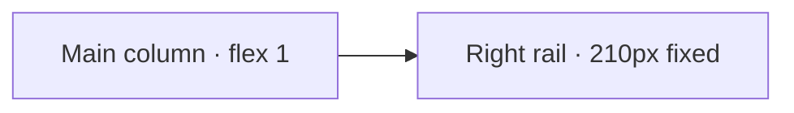
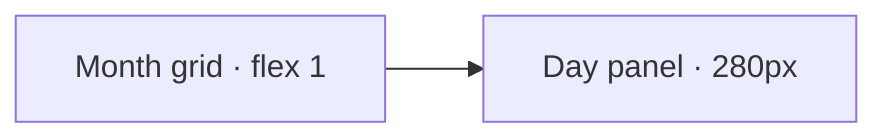
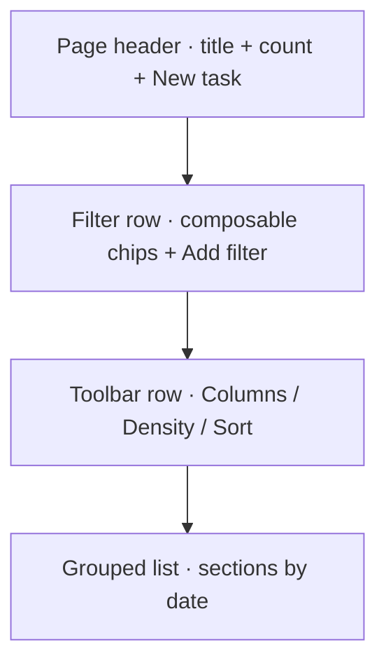
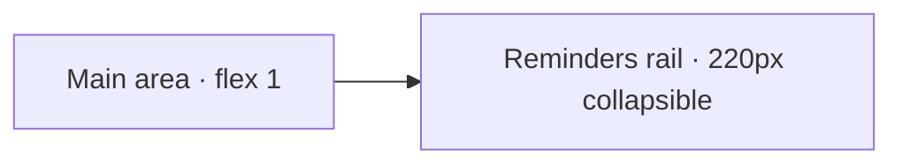
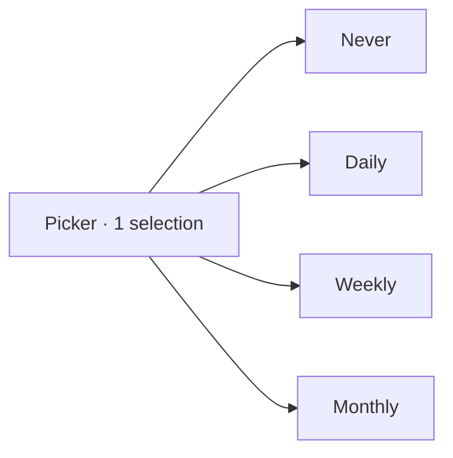
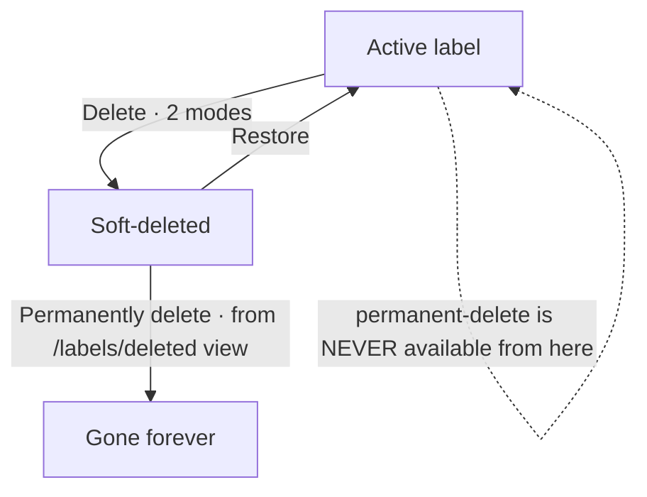

# Page wireframes

Third doc in the design-system bucket. Defines **what lives inside the content region** for each route. Component primitives (button variants, picker internals, etc.) live in `04-components.md`; motion/behavior choreography in `05-motion-and-behavior.md`.

Tokens referenced are from [`01-tokens-and-theme.md`](./01-tokens-and-theme.md). Shell behavior (top bar, sidebar, detail panel, command palette, breakpoints, handedness) from [`02-layout-and-navigation.md`](./02-layout-and-navigation.md).

## Conventions used in this doc

- 🟡 `needs backend work` — feature requires a schema change or new endpoint before it can ship.
- "Detail panel" = the GitLab-style inline panel from spec 02. "Dedicated page" = the standalone route for the same resource.
- "Backend defaults" = the field defaults declared in `apps/backend/src/features/*/*.db.ts` (e.g. `status: 'todo'`, `priority: 'medium'`, `recurringInterval: 'none'`).

## Cross-page surfaces

These appear inside multiple pages; defined once here.

- **Quick-add (dashboard only)**: title-only flat input. Enter → POST `/tasks` with `{ title, dueDate: today, status: backendDefault, priority: backendDefault, recurringInterval: 'none', projectId: null }`. New row appears with a pulse highlight + "click to edit" hint for ~3s. Editing details = click row → detail panel. (`isRecurring` field dropped — see Task detail section.)
- **Empty state pattern**: per-page section — illustrated icon, one-line description, primary action button. Tokens: surface + muted text + accent button.
- **Skeleton state**: rows fade between `--color-bg-surface` and `--color-bg-muted`, `--duration-slow` cycle, respects `prefers-reduced-motion` (no animation, just shown at one state).
- **Auth-gated routes**: every route in this spec except those under `/auth/*` requires an authenticated session. Unauthenticated requests are redirected to `/auth/login?next=<encoded original URL including query params>`. After successful sign-in, the user is bounced to that `next` URL (or to `/` if absent). The router enforces this at navigation time using the BetterAuth session state. Examples: `/tasks?priority=high&project=Backend` while logged out → `/auth/login?next=%2Ftasks%3Fpriority%3Dhigh%26project%3DBackend` → after login, restored exactly.

---

## Dashboard · `/` (default landing)

### Purpose

"Today" — the page the user opens to **execute**. Primary surface is the task list; widgets summarize other pages as glanceable previews.

### Backend touchpoints

- `GET /tasks?dueDate=today` for the Today section.
- `GET /tasks?status=todo&dueDate<today` (or similar) for Overdue carry-forward.
- `GET /tasks?dueDate>today&dueDate<=today+7d` for Coming-up.
- `GET /tasks?dueDate=<month range>` for the mini-calendar dots.
- `GET /reminders?upcoming` (or `?remindAt>=now`) for the reminders widget.

### Layout — desktop

Two-column inside the content region:



**Main column**, top to bottom:

1. Page title "Today" + date subtitle ("Thursday, 14 May · 4 tasks · 2 overdue").
2. Quick-add input (title-only flat, see Cross-page surfaces).
3. **Overdue** section (red-tinted task rows, count badge). Only shown when count > 0.
4. **Today** section.
5. **Coming up · 7 days** section.

Each section header: uppercase label + count chip. Task rows = checkbox + title + priority/label badges + due-relative mono meta ("today", "2d late", "Wed").

**Right rail**, top to bottom:

1. **Calendar widget**:
   - Month nav (◂ Month YYYY ▸) + "Open →" link to the Calendar page.
   - 7×N grid of day cells. Dot indicators: violet = has tasks, red = has overdue, cyan = has reminders (max 3 dots side-by-side).
   - Legend below grid.
   - Interaction (v1): click a day → navigates to All-tasks page filtered by that date (`/tasks?dueDate=YYYY-MM-DD`).
   - Interaction (v1.5): hover day → popover with day's task titles + "Open day in calendar" + "All tasks for day" actions. **Out of scope for v1.**

2. **Reminders widget**:
   - "Reminders" title + "Inbox →" link.
   - Up to 4-5 upcoming rows. Each: time (HH:mm or relative "tmrw"/"Sat") + reminder title + parent task name (single line, ellipsis) + quick-delete × button.
   - Click title → reminder's dedicated page.
   - Click × → soft-delete (🟡 see backend gap below).

### Layout — mobile

Single column:

1. Page title.
2. "Add a task…" button that opens the **full-form bottom-sheet** (NOT inline quick-add — mobile gets the explicit form so all fields are visible).
3. Sections (Overdue / Today / Coming up).
4. Widgets become small horizontal cards below the list (or hidden behind a "Show overview" toggle — defer to v1.5).

FAB on bottom nav (`+`) also opens the full-form bottom-sheet.

### Interactions

- Task row click → opens detail panel (`?task=<id>` query param).
- Task row checkbox → optimistic complete (status → `done`), with toast + undo.
- Quick-add Enter → creates task, focuses input again for rapid capture.
- Quick-add Esc → blurs input. No save.
- Calendar dot day click → navigates to All-tasks filtered.
- Reminder title click → reminder's dedicated page.

### Empty state

If no tasks at all: illustrated icon + "All clear" + "Add your first task" button focused on the quick-add input.
If no tasks today specifically: shorter message + same call to action.

### Backend gaps

- 🟡 **Soft delete on reminders** — the × quick-delete needs `deletedAt: timestamp` on `reminders` (and ideally `tasks`) to enable undo + a "Deleted reminders" view. Without it, × is hard-delete.

---

## Calendar · `/calendar`

### Purpose

Temporal visualization of tasks (`dueDate`) and reminders (`remindAt`). Distribution view + navigation lens. **Not** the place for bulk-edit; for that, use All-tasks.

### View switcher

Three views: **Month** (default on load) / **Week** / **Day**. Switcher in the page header alongside month navigation.

### Backend touchpoints

- `GET /tasks?dueDate>=<view-start>&dueDate<=<view-end>` for tasks in range.
- `GET /reminders?remindAt>=<view-start>&remindAt<=<view-end>` for reminders in range.

### Layout — desktop · Month view

Two-region inside content:



**Page header**: title "Calendar" + month nav (◂ MMMM YYYY ▸) + "Today" jump button + view switcher (Month/Week/Day) + "+ New task" button (right-aligned).

**Month grid**:

- 7 columns × 5–6 rows. Cell sizing:
  - **Minimum width per cell: 96px.** Below this, the grid does not squish further — the side panel relocates (see responsive rule below) and the grid reclaims width.
  - Minimum height per cell: large enough for the day number + 3 item pills + a "+N more" line. Roughly 88px.
  - Cells grow with viewport width; do not enforce a strict aspect-ratio — tall cells on ultrawide are fine and used to show more pills before truncating.
- Each cell:
  - Day number (top-left) + small count pip ("·3") when items > 0.
  - Up to **3 items** rendered as compact pills (background tint per type: violet = task, cyan = reminder w/ ⏰ icon, red = overdue task).
  - "+N more" link when items > 3.
  - Today's cell has accent border + faint tint.
  - Selected cell (i.e. the one whose panel is open) has stronger accent border.

**Day-detail side panel** (280px, right side):

- Default state on page load: **today's panel open**.
- Header: date (e.g. "Fri 15") + sub-label ("May 2026 · tomorrow"); count chips for overdue carry / counts.
- Two sections inside:
  - **Tasks** — list, priority-sorted, each row mirrors task-row style (checkbox + title + badges).
  - **Reminders** — list, time-sorted (`remindAt`), each row = time + title.
- Footer (sticky inside panel):
  - **+ New task** button → navigates to task create page **with dueDate prepopulated** to the panel's date.
  - **+ New reminder** button → navigates to reminder create page **with remindAt prepopulated** to the panel's date. 🟡 see backend gap below.
  - **All-tasks for X →** link → navigates to All-tasks filtered by that date.

### Responsive: desktop side panel moves to the bottom on narrower viewports

Within desktop range (i.e. above the mobile threshold), the side panel relocates when the grid + panel can no longer comfortably fit side-by-side.

| Breakpoint | Grid + panel arrangement |
|---|---|
| ≥ `xl` (1280px) | Grid (flex 1) + panel (280px right) side-by-side. |
| `lg`–`xl` (1024–1279px) | Grid full-width on top; panel **below the grid** full-width, ~240px tall. Same content, two columns inside (Tasks / Reminders side-by-side instead of stacked). |
| `< lg` | Mobile pattern (compact grid + bottom-sheet on tap). |

Toggling the desktop sidebar between collapsed/pinned shifts the available content width; the same rule applies to whatever content width results.

### Layout — desktop · Week view

- 7 vertical columns, each = a day. Same item rendering as month cells but **more items visible per cell** (~8-10) before "+N more".
- Side panel still present; defaults to today's day.

### Layout — desktop · Day view

- Single wide column = the chosen day's full list. **No "+N more"** — all items visible.
- Side panel collapses (redundant with the main view) OR repurposes to mini-week navigation. **Recommended v1**: hide the panel in Day view; show a "Jump to date" inline date picker in the header instead.

### Layout — mobile

Compact month grid (full-width). Day cells = number + up-to-3 dot indicators. Tap a day → **bottom sheet** mimicking the desktop side panel (same Tasks/Reminders sections + footer actions). Sheet drag-down-to-close. View switcher hidden in a "May ▾" menu in the top bar.

### Interactions

- **Visible item in a cell** (the pills) → **navigates to that item's dedicated page** (`/tasks/:id` or `/reminders/:id`). **Note:** this is a deliberate deviation from the global "inline detail panel" default in spec 02 — calendar is a navigation lens, not a working surface. Items elsewhere (Dashboard, All-tasks, Project board) still open the inline panel.
- **Day cell click (not on a pill)** → selects the day; side panel updates to that day. If panel was closed, opens it.
- **"+ New task" in the day panel** → `/tasks/new?dueDate=YYYY-MM-DD`. Form opens with date pre-filled but editable.
- **"+ New task" in the page header** → `/tasks/new` with **no** prefilled date. User picks.
- **"+ New reminder" in the day panel** → `/reminders/new?remindAt=YYYY-MM-DD`. The reminder-create page begins with a **task picker step** (since `reminders.taskId` is `NOT NULL`); the date is pre-filled in the form and remains editable. See the Reminders create section (drafted later in this doc) for the full flow.
- **"All-tasks for X →"** → `/tasks?dueDate=YYYY-MM-DD`.

### Drag-to-reschedule

**Deferred to v1.5.** Initial implementation: tasks are immutable from the calendar grid. Edit dueDate via detail page or the detail panel from other surfaces.

### Empty state

If no tasks/reminders in the visible range: keep the grid; show a soft watermark in the side panel ("Nothing on this day · + New task / + New reminder").

### Backend gaps

- ✅ **Standalone reminders** — design choice locked: keep `reminders.taskId` as `NOT NULL`. The reminder-create page handles this with a task picker step (date prefilled, task selected by user).
- 🟢 **Project color** — locked as a backend addition. Add `color: text` to the `projects` table. UX: when creating/editing a project, a color picker is shown; default value = hash-derived from the project name (deterministic at runtime), user can override. Stored value is the user's final pick. Carry-forward task — actual schema change happens before the Project page wireframes can be implemented.

---

---

## All tasks · `/tasks`

### Purpose

The master list of tasks. The "do work here" surface — filter, scan, jump into a task. Calendar is a navigation lens; this is where you actually grind.

### v1 scope (incremental build toward Linear-style power UI)

v1 ships the filter + columns + density groundwork. Bulk actions, saved views, and a user-configurable group-by selector are explicitly **out of scope** for v1 and added later when the foundation is settled.

| Feature | v1 | v1.5+ |
|---|---|---|
| Composable filter row | ✅ | (extends) |
| Columns picker | ✅ | (extends) |
| Density selector | ✅ | (extends) |
| Fixed date grouping (Overdue / Today / Tomorrow / This week / Later / No date) | ✅ (hardcoded — always this grouping) | becomes one option among several |
| URL state for filters + density + columns | ✅ | (extends) |
| Bulk actions | — | ✅ |
| Saved views | — | ✅ |
| User-configurable group-by | — | ✅ |
| View switcher (List / Table / Board) | — | possibly |

### Backend touchpoints

`GET /tasks` is extended in v1 to support **multi-value filters**:

- `projectId`: single or array (`projectId=…&projectId=…` or `projectId=A,B`)
- `status`: single or array of `'todo' | 'in_progress' | 'done'`
- `priority`: single or array of `'low' | 'medium' | 'high'`
- `labelId`: single or array (task↔label join)
- `dueDateGte` + `dueDateLte`: date range
- `q`: text search on title (case-insensitive contains)

🟢 Backend change agreed: this is a planned extension to the current single-value query.

Other endpoints used:
- `PATCH /tasks/:taskId/status` — checkbox toggle (optimistic complete).
- `GET /labels`, `GET /projects` — to populate filter pickers.

### Layout — desktop



**Page header**: title ("All tasks") + count subtitle ("23 open · 47 completed this week") + "+ New task" primary button (right-aligned, no prefilled defaults — uses backend's own defaults).

**Filter row**: horizontal chips representing the currently-active predicates. Each chip shows the operator + value(s) (e.g. `status = open`, `project ∈ Backend`, `priority ≥ medium`). Click the value to edit it (opens a picker popover); click the × to remove. A dashed `+ Add filter…` chip on the right opens an operator picker (which field) → value picker.

Predicate types in v1:

| Predicate | Operator(s) | Value source |
|---|---|---|
| Text | contains | free text |
| Project | ∈ (multi), is unset | `GET /projects` |
| Status | ∈ (multi) | enum `todo / in_progress / done` |
| Priority | ∈ (multi), ≥, ≤ | enum `low / medium / high` |
| Label | ∈ (multi), has none | `GET /labels` |
| Due date | within (range), before, after, is unset | date picker |
| Recurring | is true / is false | boolean |
| Created | within / before / after | date picker |

**Toolbar row** (below filters):

- **Columns ▾** — popover with toggleable columns: Title (always on), Priority, Project, Labels, Due date, Status, Created, Updated. Hidden columns don't render in rows. Persisted in URL + preferences.
- **Density ▾** — three options: Compact (32px row), Default (40px), Comfortable (48px). Persisted.
- **Sort: Due ↑** — clickable, opens sort field + direction popover. Single sort key in v1.

**Grouped list** — always grouped by relative date in v1. Sections render only when non-empty:

- **Overdue** (red-tinted header) — `dueDate < today AND status != 'done'`
- **Today**
- **Tomorrow**
- **This week** (7-day rolling, excluding Today + Tomorrow)
- **Later** (everything after this week)
- **No date** — tasks without `dueDate`
- **Completed (collapsed)** — task rows with `status = 'done'` whose `updatedAt` falls in the current view window. Collapsed by default; click to expand.

Each row: checkbox (toggles `status`) + title + active-column cells (priority badge, project badge with color dot, labels, due-relative mono meta). Click row (anywhere except checkbox) → opens **detail panel** (`?task=<id>`). Hover row → optional ⋯ menu (or right-click) for per-row actions (open full page, duplicate, delete) — v1.5 polish, not blocker.

### URL state contract

The URL is the source of truth for filters / density / columns / sort. Examples:

```
/tasks
/tasks?status=open
/tasks?project=Backend,Personal&priority=medium,high&sort=dueDate-asc
/tasks?q=auth&columns=priority,project,due
/tasks?density=compact
```

Round-trip: any UI change to filter/density/columns/sort updates the URL (replace, not push, to avoid history spam) and back/forward navigation restores state. A shared link reconstructs the exact view.

### Layout — mobile

Filter bar collapses to a single **Filters (N)** button (shows active filter count). Tap → bottom-sheet picker with the same predicate types. Columns/Density not exposed on mobile — fixed to a sensible mobile-default (Title + Priority + Due only, Default density). Sort selector still present in the toolbar.

Rows render in their grouped sections same as desktop. Tap row → bottom-sheet task detail (per spec 02).

### Empty states

- No tasks in the workspace at all: illustrated "No tasks yet" + "+ Create your first task" button.
- Filters returned no results: "No tasks match these filters" + "Clear filters" button. Don't collapse sections — show the empty result message in place of the list.

### Out-of-scope-but-relevant (clearly deferred)

- **Bulk multi-select** — adds a left-aligned bulk-action bar above the list when items selected. Shift-click + Cmd/Ctrl-click. Keyboard shortcuts (`x` toggle, `e` open, `c` complete, `⌫` delete). Schema is already in place (status mutation, delete endpoint exists); UI build is what's deferred.
- **Saved views** — tabs at the top serializing the current filter+columns+density+sort+grouping state. Probably stored under user preferences (new `tasks_views` table or embedded JSON on user).
- **Configurable Group-by** — Group: Date (default) / Project / Priority / Status / Label / None. v1 keeps Date hardcoded; the implementation should structure the section-rendering code so a different grouping function can drop in later without restructure.

### Backend changes for v1 (`GET /tasks` extension)

- Accept multi-value query params (array or comma-separated).
- Accept date-range (`dueDateGte`, `dueDateLte`).
- Accept text search (`q`).
- Existing single-value behavior continues to work — backwards compatible.

### Backend gaps

- 🟢 `GET /tasks` multi-value extension — agreed, will be added.
- 🟢 Project color (carry-forward) — agreed, will be added.

---

---

## Projects list · `/projects`

### Purpose

Entry point into per-project work. Browse all projects (single-user v1, no sharing), see overall health at a glance, jump into one.

### Backend touchpoints

- `GET /projects` for the grid.
- Counts on each card require either:
  - Per-card `GET /tasks?projectId=X&status=…` calls (n+1 — fine for ≤ a few dozen projects).
  - OR a backend extension `GET /projects` that includes computed stats per project. Defer that extension; n+1 is acceptable for v1.

### Layout — desktop

- Page header: "Projects" title + count subtitle ("4 projects · 27 open tasks total") + "+ New project" primary button (right).
- Filter-by-name search input below header (single text field, no operators).
- Grid: responsive `repeat(auto-fill, minmax(240px, 1fr))`, gap = `--space-3`. Roughly 3 columns at desktop, scaling to 4–5 at xl+, 2 at md, 1 at sm.

Each **project card**:

- Color accent band at the top (3px high, full-width inside card padding).
- Name + color-dot (project's color).
- Description (optional, max 2 lines, ellipsis).
- Stats row (3 stats, mono numerals): Overdue (red when > 0) · Open · Done · 7d. Top-bordered separator.
- Meta footer: "Updated 2h ago" (or similar relative time).

Last cell of the grid = dashed "+ New project" tile. Click → opens project-create form (route: `/projects/new` or a modal — decide in component spec).

### Layout — mobile

Single column grid (auto-fill collapses to one). Cards stack vertically. Search remains. "+ New project" tile still last.

### Interactions

- Click card → navigates to `/projects/:id` (project page).
- Hover card → faint border accent + cursor pointer.
- "+ New project" → create form (color picker + name + description). Default color = hash-derived from name; user can override.
- Search input filters by name (client-side fine for v1 given small project counts).

### Empty state

No projects yet: large illustrated "Group your tasks into projects" + primary "+ Create your first project" button.

---

## Project page · `/projects/:id`

### Purpose

The working surface for one project. Tasks are the primary content; reminders (tied to tasks in this project) live in a secondary, collapsible side rail.

### Mental model

- **Tasks are the main thing.** Board view (kanban, default) and List view are two ways to render them.
- **Reminders are derived.** A reminder belongs to a task (`reminders.taskId NOT NULL`). The page loads the project's task IDs, then queries reminders for those tasks. Side rail surface only — never the main area.
- **No three-way tab selector.** The previous Board/Tasks/Reminders tab structure was misleading (Tasks vs Board read as competing views). Separating "view mode" (Board/List) from "entity rail" (Reminders side panel) makes the model clean.

### Backend touchpoints

- `GET /projects/:id` — project header data.
- `GET /tasks?projectId=:id` (multi-value filters as defined in All-tasks).
- `GET /reminders?taskId=∈ <list>` — for the reminders side rail. **Backend extension needed**: today the reminders endpoint likely keys on a single task. Add multi-value `taskId` query (same pattern as the `GET /tasks` extension).
- `PATCH /tasks/:taskId/status` — drag-to-column.
- `POST /tasks` — inline quick-add.

### Layout — desktop



**Header**: breadcrumbs (`Projects › Backend`) → page title (color-dot + project name) + sub-stats ("11 open · 3 overdue") + ⋯ menu (rename / edit color / delete) + view-mode segmented control + "Filters" button + "+ Task" primary button.

View-mode toggle: **Board** (default) ↔ **List**.

#### Board view

- 3 fixed columns matching the backend status enum: **To do · In progress · Done**.
- Each column: header (name + count + `+` icon) + scrollable body of cards + sticky "+ Add task" footer.
- Card: title, badges (priority, labels), mono due-relative meta. Drag the card to another column → `PATCH /tasks/:taskId/status` with optimistic UI + rollback on failure.
- **Inline quick-add per column** (see Cross-page surfaces below).
- Done column displays cards with strikethrough + reduced opacity. Default scope: `updatedAt` within the current view window (e.g. last 7 days). Beyond that, a "Show older" footer reveals more (lazy-loaded). Avoids the column ballooning indefinitely.

#### List view

Reuses the **All-tasks list component** with `projectId` locked to this project. Same filters / columns / density / URL-state contract. Header "+ Task" prefills `projectId`.

#### Reminders side rail (220px, right edge)

- Header: "Reminders" title + count chip + "▾ Hide" toggle. Collapsed state: 28px-wide icon strip with the count badge; click to expand.
- Body: chronological list (`remindAt` ascending). Each row:
  - Time (HH:mm · today / tmrw / day-name / date) — cyan mono.
  - Reminder title (1 line, ellipsis).
  - Parent-task name as small caption underneath.
  - Click title → reminder's dedicated page (consistent with calendar pattern).
- Footer: "+ New reminder" link → opens reminder-create flow with **task-picker step constrained to this project's tasks** (per spec 02 / calendar section). Date defaults to today; editable.
- Empty state: "No reminders for this project · + Add one".

### Layout — narrower desktop

Same responsive rule as the calendar: when the main area + side rail can't comfortably co-exist (below `xl`), the side rail relocates to **below** the main area as a full-width accordion section ("Reminders · 5 ▾"). Collapsed by default at that width. Mobile follows the same pattern.

### Layout — mobile

Single column. View-mode toggle still present; Board view becomes horizontally-swipeable (one column at a time, page-indicator dots at the bottom). List view = vertical scroll as on All-tasks mobile. Reminders becomes a collapsed accordion at the bottom of the page.

### Inline quick-add (board column)

Cross-page surface; defined once here, referenced from other contexts later.

Flow:

1. **Idle** — column footer shows a subtle `+ Add task` button.
2. **Click** — button morphs into an editable row at the bottom of the column. Title `<input>` is focused. Hint visible: "⏎ save · esc cancel".
3. **Enter** — POST `/tasks` with `{ title, status: <column status>, projectId: <this project>, priority: 'medium', isRecurring: false, recurringInterval: 'none', dueDate: null }`. Card appears at the column bottom with a brief pulse + "click to edit ✎" hint.
4. **Input stays focused** for rapid sequential adds. Esc / explicit "Done" collapses the row back to the button.

Status + projectId are silent defaults from context; everything else uses backend defaults; no due-date is presumed (user adds via detail panel). The same pattern works for any column-quick-add context (project boards in v1; future status-grouped views).

### Drag-to-status semantics

- Drag a card into a column → status changes to that column's value.
- Optimistic update: card moves immediately. On API error, animate back to origin + show error toast.
- Reordering within a column = **not supported in v1** (no `position` / `order` field on tasks backend-side). Cards are sorted by a stable rule (e.g. priority desc, then dueDate asc, then createdAt desc).

### Empty states

- Project with no tasks at all: main area shows a soft watermark + primary action "+ Add your first task". Reminders rail shows its own empty state.
- All tasks done: cheerful "All clear" + "+ Add task" + "Show recently completed" toggle.

### Backend changes for v1 (additional, on top of those for All-tasks)

- 🟢 **`GET /reminders` multi-value taskId filter** — `taskId=A,B,C`. Required to load all reminders for a project's task set in one call.

### Backend gaps

- 🟢 Reminders multi-value filter (above).
- 🟢 Project color (carry-forward).
- 🟢 `GET /tasks` multi-value filters (carry-forward from All-tasks).
- Out of scope v1: per-card column ordering / sortable kanban (no schema field). Add `position: integer` on tasks if/when this becomes desired.

---

---

## Task detail · inline panel + dedicated page (`/tasks/:id`)

### Purpose

Single source of truth for "everything about one task". Two render contexts share one component:

- **Inline panel** — opens via `?task=<id>` query param over the current page. Right edge, 400–480px, resizable. Background page stays visible. Default behavior across Dashboard, All-tasks, Project board, Inbox, Labels (anywhere a task surface exists). Calendar items are the deliberate exception — they navigate to the dedicated page (per Calendar section).
- **Dedicated page** — full route `/tasks/:id`. Two-column layout (main + 280px aside) at desktop wide. Bookmarkable, shareable, focus-friendly.

**Responsive parity**: the dedicated page **collapses its two-column layout into the panel-style single-column** below the `xl` (1280px) breakpoint. Because both contexts share the same component, the narrow desktop / mobile dedicated page renders identically to the inline panel — just without the page chrome (sidebar nav + top bar). Mobile shell wraps it in a back-button header instead of the panel close-X.

### Content (top to bottom in panel; main column on dedicated page)

#### Title block

- Breadcrumbs (project › task id) — read-only.
- Title text + **pencil icon (✎)** to the right.
- Click pencil → title becomes an editable input; pencil is replaced by a **✓ (commit)** and **✗ (cancel)** pair. Enter = commit; Esc = cancel.
- This explicit edit-mode pattern is the convention for every inline-editable field on this surface (description, chips, dates). No hover-revealed implicit edit.

#### Quick toggles

Two segmented controls side-by-side:

- **Status**: `todo · in progress · done`. Active segment tinted neutral / violet / green. Click → `PATCH /tasks/:taskId/status`, optimistic.
- **Priority**: `low · med · !high`. Same pattern.

Both write immediately. No commit button.

#### Field grid

Field rows, left column = uppercase label, right column = value. Click a value row → opens its picker (popover). Empty rows show muted italic placeholder. Hover row → subtle bg.

| Field | Picker | Backend write |
|---|---|---|
| Project | searchable popover of `GET /projects` (+ unset) | `projectId` |
| Labels | multi-select popover of `GET /labels` (+ create new inline) | task↔labels join writes |
| Due | inline date picker + "clear" | `dueDate` |
| Recurrence | popover with 4 options (Never / Daily / Weekly / Monthly) | see Recurrence below |
| Created | read-only `--mono` timestamp | — |
| Updated | read-only `--mono` timestamp | — |

The mockup's inline panel was missing Created/Updated — confirmed they belong here. The aside-card on the dedicated page shows them at the bottom.

#### Description

Markdown.

- Two toggles at the top: **Read** (rendered) / **Write** (textarea).
- "Read" mode renders headings, lists, code, code-blocks, links — minimal markdown surface. No tables/images in v1 (defer).
- "Write" mode = plain textarea, monospace font for code-block readability. Edit-mode pattern: no pencil here — toggling Write IS the edit mode.
- Auto-save on Write → Read switch. Esc reverts unsaved changes.

#### Reminders sub-list

- Section header with count + "+ Add reminder" inline action.
- Each row: time (HH:mm · today / Fri / date) + title + ⋯ menu (edit / delete).
- "+ Add reminder" expands an inline form (same inline-quick-add pattern as kanban): time picker + title input. Date defaults to the task's due date (or today if no due).
- Click row title → reminder's dedicated page.

#### Activity

v1: minimal stub showing only what's reconstructable from existing fields — `createdAt` ("created this task") and `updatedAt` ("updated"). Surfaced as an informational note that the full activity log is a v2 feature requiring a backend `task_events` table.

#### Comments

v1: not surfaced. Will be added once multi-user / sharing is in scope (backend table + endpoint deferred to v2+).

#### Footer actions

- **Duplicate** — clones the task. Backend endpoint not yet defined (see Backend changes below). v1 implementation can compose `POST /tasks` client-side from existing values if no endpoint lands first.
- **🗑 Delete** — soft delete (see Backend changes below). Toast with undo. Hard-delete reserved for a "Permanently delete" action inside a "Deleted items" view (deferred).

### Recurrence picker



Backend currently has two fields (`isRecurring: boolean` + `recurringInterval: enum 'daily'|'weekly'|'monthly'|'none'`). They can disagree (`isRecurring=true, recurringInterval='none'` is technically allowed but meaningless). **Decision: drop `isRecurring`.** The enum value alone fully encodes whether and how a task recurs (`none` = single occurrence; any other value = recurring with that cadence).

Frontend picker is a single popover with 4 options. Writes to backend:

| Picker choice | Backend payload |
|---|---|
| Never | `{ recurringInterval: 'none' }` |
| Daily | `{ recurringInterval: 'daily' }` |
| Weekly | `{ recurringInterval: 'weekly' }` |
| Monthly | `{ recurringInterval: 'monthly' }` |

Schema change required: remove the `isRecurring` boolean column. Migration drops the field; any code reading it switches to `task.recurringInterval !== 'none'`. Logged in Backend changes.

### Keyboard shortcuts (within the panel / page)

| Shortcut | Action |
|---|---|
| `e` | Focus the title pencil (start editing title) |
| `c` | Toggle complete (status → `done` / back) |
| `[` / `]` | Cycle through tasks in the underlying list (panel context only — disabled on dedicated page) |
| `Esc` | Close panel / return from edit mode |
| `⌘+Enter` while in Write mode | Save & switch to Read |
| `⌫` on the page (focus outside any input) | Trigger delete confirmation |

### Layout — desktop dedicated page

Two-column, main + 280px aside:

- **Main**: breadcrumbs, title, quick-toggles, description, Reminders sub-list, Activity stub.
- **Aside**: field grid (Project / Labels / Due / Recurrence / Created / Updated). Duplicate + Delete buttons below the card.

### Layout — narrow desktop & mobile

Below `xl`, dedicated page becomes single-column — identical to the panel layout. Aside fields slot into the main column flow between the quick-toggles and the description.

Mobile dedicated page wraps the component in a back-button header ("← Back to Backend") instead of the panel ✕ close.

### Empty states

- New task just created (only title set): description empty → muted "Click Write to add details". Reminders empty → muted "No reminders yet · + Add reminder".

### Backend changes for v1

Aggregating the new ones surfaced in this section:

- 🟢 **Drop `tasks.isRecurring` column.** `recurringInterval` enum alone encodes recurrence. Migration + corresponding code change in the backend service/repo layer.
- 🟢 **Add `tasks.deletedAt: timestamp` (nullable).** Soft-delete semantics for tasks. All list endpoints filter `deletedAt IS NULL` by default; a `Deleted items` view (v1.5) queries the inverse.
- 🟢 **Add `reminders.deletedAt: timestamp`** (paired with tasks).
- 🟡 **Duplicate-task endpoint.** Not in scope to design now; user has noted backend refactoring/planning happens after the frontend design wraps. v1 frontend can compose `POST /tasks` from existing values if needed before an endpoint is added. **Defer endpoint design to backend phase.**
- 🟡 **Activity log (`task_events`).** No table today. Defer to v2.
- 🟡 **Comments.** Defer (multi-user prerequisite).

### Out of scope (v1.5+ or v2)

- Drag-reorder of reminders within a task.
- Comments thread.
- Full activity log (status changes, label add/remove, reminder fires).
- Watchers / mentions / multi-user surfaces.
- File attachments.
- Subtasks.

---

---

## Inbox · `/inbox`

### Purpose

Reminder action-center. The single place where reminders that have **fired** (their `remindAt` is in the past) wait to be cleared. Upcoming reminders are shown elsewhere (dashboard widget, calendar day panel, project rail, task detail) — Inbox is intentionally narrow.

The name "Inbox" leaves room for future system notifications (mentions, comment-replies, etc.) to slot in as a sibling section — v2+ territory, deferred.

### v1 scope (intentionally minimal)

| Feature | v1 | Deferred to "later backend update" |
|---|---|---|
| **Now** section · reminders where `remindAt <= now AND deletedAt IS NULL` | ✅ | — |
| "Done" button · soft-deletes the reminder | ✅ | — |
| "× Dismiss" button · soft-deletes the reminder | ✅ (same effect as Done for now) | distinguished from Done via `acknowledgedAt` |
| **Snooze** action · preset 15m / 1h / 3h / tmrw / pick… | ✅ (backend already supports `PATCH /reminders/:id { remindAt }`) | — |
| "+ New reminder" page action | ✅ (task-picker flow) | — |
| Today / Upcoming / Past buckets | — | adds date-range query usage but otherwise no backend change |
| Snooze action (preset 15m / 1h / 3h / tmrw / pick) | — | `PATCH /reminders/:id` already supports it; just UI work |
| Past · restore view (browse soft-deleted) | — | needs the soft-delete first, then a view querying `deletedAt IS NOT NULL` |
| `acknowledgedAt` to distinguish "Done" vs "Dismiss" | — | schema field needed |
| System notifications (mentions / etc.) | — | new `notifications` table required (v2+) |

**Design intent**: v1 ships a focused "things that need my attention right now" surface. Once the rest of the app is designed and the backend is reviewed as a whole, the deferred buckets and snooze land together.

### Backend touchpoints

- `GET /reminders?remindAtLte=<now>&deletedAt=null` — load reminders due for action. Needs `remindAtLte` query support (range filter on reminders) and the `deletedAt IS NULL` default filter (covered by the soft-delete extension already planned).
- `PATCH /reminders/:reminderId` with `deletedAt = now` — Done and Dismiss both write this.
- `GET /tasks/:id` — fetch parent-task context for the linked-task chip (already supported).

### Layout — desktop

Single column inside the content region. No two-column split, no side panel.

**Page header**: title "Inbox" + sub-count ("N to action") + "+ New reminder" primary button (right). Theme/avatar/etc. live in the global top bar.

**Section header** (one section in v1): "⚡ Now · awaiting action" with count chip.

**Reminder row**:

- Time block (left, ~70px): absolute time (`HH:mm` for today, `Fri · HH:mm` for older) + relative time ("5 min ago" · `--mono`, muted).
- Body (flex): title (medium weight) + optional `content` line (muted, ellipsis if long) + parent-task chip linking to that task's dedicated page.
- Actions cluster (right): **Done** (primary tinted pill) · **Snooze ▾** (popover menu: 15m / 1h / 3h / tmrw / pick…) · **× Dismiss** (ghost danger on hover).
- Whole row has subtle accent border + faint accent-tinted background to signal "this needs you".

Empty state (no reminders in Now): centered "All clear" illustration + soft "Nothing waiting for you" copy + secondary "+ New reminder" button. **Important**: this is the *intended* state — Inbox sitting empty means you're caught up. Not framed as a failure.

### Layout — mobile

Same single column. Top-bar title becomes "Inbox". Action cluster on rows wraps to a second line when needed (Done + Dismiss as full-width-ish buttons at the bottom of the row).

### Interactions

- **Done** → optimistic soft-delete (row collapses out with toast "Done · Undo"). Same backend write as Dismiss in v1.
- **Snooze ▾** → opens a popover with preset durations (15m / 1h / 3h / tomorrow morning / pick a specific time…). Selecting any option sends `PATCH /reminders/:reminderId { remindAt }` with the computed future timestamp. Row exits the Now bucket immediately (optimistic) and reappears at the scheduled time. "Pick…" opens a full date+time picker.
- **× Dismiss** → optimistic soft-delete (row collapses out with toast "Dismissed · Undo"). UI copy differs from Done but backend effect is identical. v1.5 introduces `acknowledgedAt` to distinguish.
- **Click parent-task chip** → navigates to that task's dedicated page (consistent with Calendar's item-click navigation rule).
- **Click reminder title** → reminder's dedicated page (full edit).
- **+ New reminder** (page header) → opens reminder-create page with the task-picker step (same flow as Calendar's day-panel "+ New reminder", Project rail's "+ New reminder", Task detail's "+ Add").

### What the bell icon in the global top bar surfaces

(Cross-reference to spec 02.)

The top-bar bell popover shows the latest 5 reminders in the Now bucket — same query as Inbox, capped. Footer link "Open inbox" → `/inbox`. Unread dot on the bell when `count > 0`.

This is a glanceable preview only. Acting on a reminder (Done / Dismiss) from the popover writes to the same endpoint as the Inbox page.

### Backend changes for v1

Aggregating new ones:

- 🟢 **`GET /reminders` range filter** — `remindAtLte` (and `remindAtGte` for completeness). Pairs with the multi-value `taskId` filter already planned.
- 🟢 **Reminders soft-delete + default `deletedAt IS NULL` filter** — already locked from Task-detail section; Inbox depends on it.

### Backend gaps (deferred · "later backend update")

All of the following are batched for a single backend pass after the rest of the frontend design is finalized:

- 🟡 `acknowledgedAt` column on reminders (distinguishes Done from Dismiss).
- 🟡 Past · restore view (list of soft-deleted reminders; "Restore" action sets `deletedAt = null`).
- 🟡 Today / Upcoming buckets in Inbox (purely query-shape work; no schema change beyond what's already planned).
- 🟡 System notifications table for v2+ mentions / replies / due-date warnings.

---

---

## Labels · `/labels`

### Purpose

Manage tags assignable to tasks: name + color + per-label task count. Single flat page; no tabs.

### Backend touchpoints

- `GET /labels` (with task counts; see Backend changes below).
- `POST /labels` for create.
- `PATCH /labels/:id` for name/color edits.
- `PATCH /labels/:id { deletedAt: now }` for soft-delete (plus optional cascade — see delete model below).
- `DELETE /labels/:id` for hard permanent-delete from the deleted-labels view.

### Layout — desktop

Page header: title "Labels" + sub-count ("6 labels · 18 tasks tagged") + Sort segmented control (right-aligned).

Filter-by-name text input below header (single field, client-side filter on loaded list).

**Inline create row** at the top of the table area:

- Color swatch on the left (clickable → color popover).
- Name input.
- Default color = hash-derived from current input text (recalculates as user types, freezes on first manual swatch click).
- Enter or "Create" button → `POST /labels`. Row resets and stays focused for rapid creation. Esc / Cancel collapses the create row to a "+ New label" button.

**Table** rows:

| Col | Width | Content |
|---|---|---|
| Swatch | 28px | 16×16 color square; click → color popover (immediate commit on selection) |
| Name | flex | Click to edit inline (✓/✗ commit pattern; lighter than task-title pencil since names are short) |
| Tasks | 80px | Mono count. Click → navigates to All-tasks page with this label preselected (`/tasks?labelId=…`). |
| Actions | 100px (right-aligned) | Filter → / Edit / Delete |

Hover row → subtle accent tint. Selected/editing row → outlined.

### Color popover

- 12-color preset palette as a 6×2 grid.
- Custom hex input below (mono font; pastes/edits a 6-digit hex).
- Click preset → commits + closes. Custom → "Use" button (or Enter) commits.

### Inline name editing

Click name → becomes editable text input + ✓ / ✗ buttons appear in the Actions cell. Enter = commit · Esc = cancel. No pencil icon here — single-tap-to-edit is appropriate for a table row context.

### Delete model — three tiers



**Deleting an active label** opens a confirmation modal with TWO options:

1. **Soft-delete · keep task links (default · less destructive)**
   - Writes `labels.deletedAt = now`.
   - `task_labels` rows are **untouched** — the FK from each tagged task to this label survives.
   - UI consequence: label disappears from chips/filters everywhere (every list query filters by `labels.deletedAt IS NULL`). Tasks behave as if the label was never there.
   - **Restore** later → `deletedAt = null` → the label "magically" reappears on every task that was tagged before (the FK rows were preserved).
   
2. **Soft-delete · remove from tasks**
   - Writes `labels.deletedAt = now` AND `DELETE FROM task_labels WHERE labelId = :id`.
   - Restoring later → label exists again but no tasks are tagged. User would have to re-tag.

The modal shows the impact count ("This will affect N tasks"). Default radio = Option 1.

**Permanent delete** is only available in the **Deleted labels** view (`/labels/deleted` or `/labels?tab=deleted` — pick the routing pattern at component spec time). From there:

- **Restore** → `deletedAt = null`. (Whether the label has task links depends on which delete mode was chosen.)
- **Permanently delete** → hard `DELETE FROM labels WHERE id = :id`. FK cascade on `task_labels` (already configured ON DELETE CASCADE) cleans up any remaining join rows. Gone forever, no recovery.

Permanent-delete from the deleted-labels view shows a second confirmation (irreversible action UX).

### Deleted labels view

Same table layout as the active list, but:

- All rows are visibly muted (lower opacity + strikethrough on name).
- Actions become: **Restore** · **Permanently delete** (no Edit, no Filter →).
- Tasks count shows what the user picked at delete time — either "still tagged on N tasks" (mode 1) or "untagged" (mode 2).
- A small "i" tooltip explains the difference between Restore + Permanently delete.

Entry point: a "View deleted (N)" link in the bottom-right of the main `/labels` page, or a small tab toggle in the header. Decide at implementation; the routing pattern is what's locked here.

### Mobile

Single column. Actions cell collapses into a ⋯ menu when viewport narrows below `md`. Inline create row stays. Color popover renders as a bottom-sheet on mobile.

### Empty states

- No labels at all: large illustrated "Tag tasks for easier filtering" + the inline-create row pre-focused.
- All labels are soft-deleted: deleted view shows them; active view shows the empty state above.

### Backend changes for v1

- 🟢 **`labels.color` becomes `NOT NULL`** — every label has a color in the UX. Migration backfills existing rows by hashing the name to a deterministic hex.
- 🟢 **Soft delete on labels** — `deletedAt: timestamp nullable`. List endpoints filter `deletedAt IS NULL` by default; the deleted-labels view queries the inverse.
- 🟢 **`GET /labels` with per-label task count** — JOIN on `task_labels` filtered by tasks where `tasks.deletedAt IS NULL` (so the count reflects only live tasks). If the JOIN cost is unwanted, expose a separate `GET /labels/:id/usage` endpoint instead.
- 🟢 **Two-mode delete** — `PATCH /labels/:id` accepts a `removeFromTasks: boolean` flag along with `deletedAt = now`. When `removeFromTasks=true`, the same transaction also wipes `task_labels` rows for this label. When `false` (default), only `deletedAt` is written.
- 🟢 **Permanent delete endpoint** — `DELETE /labels/:id` (callable only when the label is already soft-deleted, server-validated). FK cascade on `task_labels` is already configured (`ON DELETE CASCADE` in the existing schema). Hard delete also wipes the deleted-labels row for good.
- 🟢 **List endpoints joining labels filter `labels.deletedAt IS NULL`** — task detail, all-tasks label chip rendering, etc. must hide chips whose label is soft-deleted. Backend can either project the join or the consumer can filter — backend phase decides.

---

---

## Settings · `/settings/*`

### Purpose

User preferences + account management. Sectioned so each lives at its own route and is deep-linkable.

### Backend touchpoints

- BetterAuth endpoints for: display name update, email change (with verification), password change, account delete.
- `users/preferences` endpoint (planned; see Backend changes) for app-level prefs (theme, density, handedness, sidebar default, reduce-motion).
- `GET /export/tasks` and `GET /export/preferences` for data export (planned).

### Layout — desktop

Two-column inside the content region: sub-nav (200px) + panel (flex 1). Sub-nav links are real routes; clicking changes the URL.

### Sections (v1)

| Section | Route | Contents |
|---|---|---|
| Profile | `/settings/profile` | Display name · Email (verified) · Password change · Delete account (destructive, separate from delete-data) |
| Display & layout | `/settings/display` | Theme (System/Light/Dark) · Density · Primary thumb side (Left/Right) · Apply to desktop too (toggle) · Sidebar default (Collapsed/Pinned) · Reduce motion (overrides OS) |
| Data | `/settings/data` | Export · Import |
| About | `/settings/about` | App version · Links to docs / repo |

Notifications is **hidden in v1** — no email/push delivery backend exists yet. Section returns when backend gains email/push capability.

### Layout — mobile

Sub-nav collapses to a list page at `/settings`. Each item navigates to its own route. Back button returns to the list. Each section renders the same panel content full-width.

### Data section · export + import

Three buttons:

| Button | Behavior |
|---|---|
| **Export tasks & reminders** | Downloads `tasks-and-reminders-<YYYY-MM-DD>.json` containing the user's tasks, reminders, projects, labels, and task-label join rows in a portable shape. JSON only in v1. |
| **Export preferences** | Downloads `preferences-<YYYY-MM-DD>.json` containing all `users/preferences` values (theme, density, handedness, etc.). JSON only. |
| **Download all** | Triggers both exports in one click (two file downloads, in sequence). |
| **Import** | Placeholder button. Click → toast "Import is a work in progress · coming soon". Disabled (or kept enabled but doesn't act) — pick at component spec. |

### Profile section · destructive actions

Two distinct destructive actions, clearly separated:

- **Delete account** (Profile section, bottom) — permanently removes the BetterAuth user record + cascades to all data. Two-step confirmation (type the email to confirm). Out of scope to design the modal in detail here; flag in component spec.
- **Delete all data** (Data section, future) — wipes user-owned tasks/projects/labels/reminders but keeps the account. v1 can defer this if export is enough of an escape hatch.

### Preference storage

- v1: client-side localStorage keyed by user id.
- v1.5: backend endpoint `GET/PATCH /users/preferences` (single JSON blob or columnar — backend phase decides). Client reads from backend on sign-in, writes through on change.
- Each Display & layout setting in the page panels writes to the active store.

### Backend changes for v1

- 🟢 **`GET /export/tasks` (JSON)** — returns a serializable bundle of tasks, reminders, projects, labels, task-labels for the authenticated user. Soft-deleted items excluded by default (param to include them later).
- 🟢 **`GET /export/preferences` (JSON)** — returns the user-preferences blob.
- 🟡 **Import endpoints** — deferred. Placeholder UI only in v1.
- 🟡 **`users/preferences` endpoint** — deferred to v1.5; localStorage in v1.

---

## Auth · `/auth/*`

### Purpose

Sign-in, sign-up, password recovery. Standalone shell — no app chrome (no sidebar, no top bar, no bottom nav).

### Backend touchpoints

All handled by BetterAuth mounted at `/auth/*` (server route, distinct from these client routes that live under the same path namespace by intent).

- Sign-in: email + password → session cookie.
- Sign-up: email + password + display name. `autoSignIn: true` configured — successful sign-up immediately signs the user in. **v1 skips email verification** (BetterAuth supports it via the `verifications` table; can be enabled later without UX rework).
- Forgot password → email with token → reset form.
- Verify email → only used once verification is re-enabled.

### Routes

- `/auth/login` — sign-in.
- `/auth/signup` — create account.
- `/auth/forgot` — request password reset.
- `/auth/reset?token=…` — set new password.
- `/auth/verify?token=…` — email verification landing (hidden flow v1; routes exist for future).

### Layout — shared shell

- Background: dark (or light per theme); subtle gradient using `--color-accent-primary-subtle` + `--color-accent-secondary-subtle` radial blobs.
- Card: centered, ~360–380px wide, `--radius-xl`, `--shadow-pop`, `--space-6` padding.
- Card contents: app logo + page title + sub-line + form fields + primary action button + secondary link (toggle to other route).

Mobile: card becomes full-width with margin.

### Login form fields

- Email (`type="email"`, required).
- Password (`type="password"`, required, has visibility toggle eye icon).
- **Remember me** checkbox (default checked). When checked, session cookie set with long expiry (e.g. 30 days). Unchecked = session cookie only.
- "Forgot password?" link → `/auth/forgot`.
- Primary "Sign in" button.
- Footer: "no account yet? · Create one →" link to `/auth/signup`.

### Signup form fields

- Display name (required, non-empty).
- Email (required, valid).
- Password (8–30 chars per BetterAuth config). Helper text below: char-count rules + reveal eye icon.
- Primary "Create account" button.
- Footer: "already have one? · Sign in →" link.
- Error states inline at the top of the card (email-already-registered, invalid-password, network) — accent-red border on the offending field.

### Post-auth redirect

- Read the `?next=<url>` query param if present (set by the auth-gated-routes redirect).
- After successful sign-in/sign-up:
  - If `next` is present and is a same-origin path → navigate there.
  - Otherwise → navigate to `/` (dashboard).
- Block `next` values pointing to external origins for safety (open-redirect prevention).

### Forgot / reset flow

- `/auth/forgot` → email input + "Send reset link" button. Success state: "Check your inbox" message, no PII leakage about whether the email exists (return a generic message either way).
- `/auth/reset?token=<jwt-or-similar>` → new-password input + confirm + "Set password" button. Token validated server-side; bad/expired token shows an inline error with a "Request a new link" CTA.

### Auth-gated client routing

(See cross-page surfaces at the top of this doc.) Every non-`/auth/*` route requires a valid session. Router-level guard redirects to `/auth/login?next=<encoded original URL>` when unauthenticated. The session check happens before route rendering.

### v1 decisions

- **Email verification: skipped.** `autoSignIn` stays. Users can use the app immediately after signup. Re-enable later by flipping a BetterAuth config flag and surfacing the verify route in onboarding.
- **Remember me: yes**, default checked.
- **No 2FA / SSO / OAuth providers** in v1. Email+password only.
- **No "magic link" passwordless** in v1.

### Backend changes

- 🟢 None for v1 — BetterAuth already covers everything. Verification toggle is a config flip if/when re-enabled.

---

---

## Spec status

All v1 pages are drafted: Dashboard · Calendar · All tasks · Projects list · Project page · Task detail · Inbox · Labels · Settings · Auth. Backend-changes-needed are flagged per section with 🟢 (planned) / 🟡 (deferred).

Next docs:

- `04-components.md` — component primitives (button variants, picker internals, dialogs, toasts, menus).
- `05-motion-and-behavior.md` — choreography, drag-reorder, micro-interactions, optimistic-UI states.

And a separate consolidating doc may be useful:

- `docs/stable/_shared/design/backend-changes-summary.md` — single page listing every 🟢 + 🟡 surfaced across specs 01–05, grouped by table/endpoint. Built once the design phase finishes, so the backend redesign phase has a single checklist to work from.
- Projects list · `/projects`.
- Project page · `/projects/:id` — Board (kanban) · Tasks (list) · Reminders tabs.
- Task detail · panel + dedicated page (`/tasks/:id`).
- Inbox · `/inbox`.
- Labels · `/labels`.
- Settings · `/settings/*`.
- Auth · `/auth/*` (separate shell).

Each will be appended as its own section in this same file.
