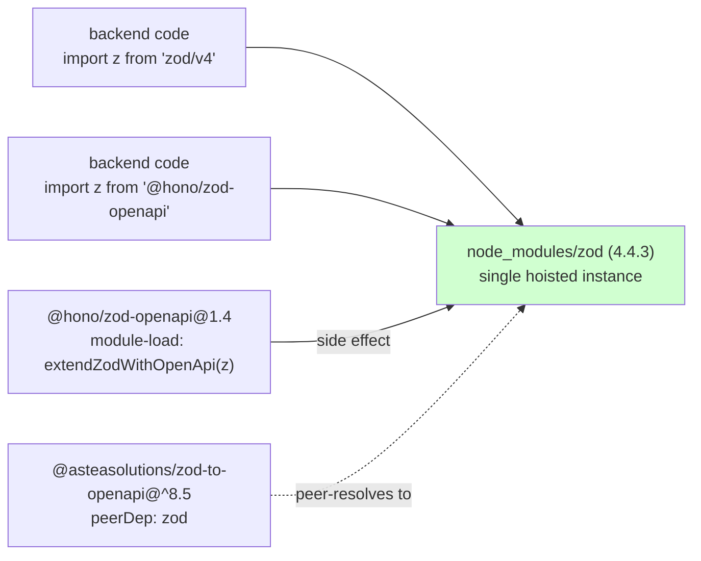
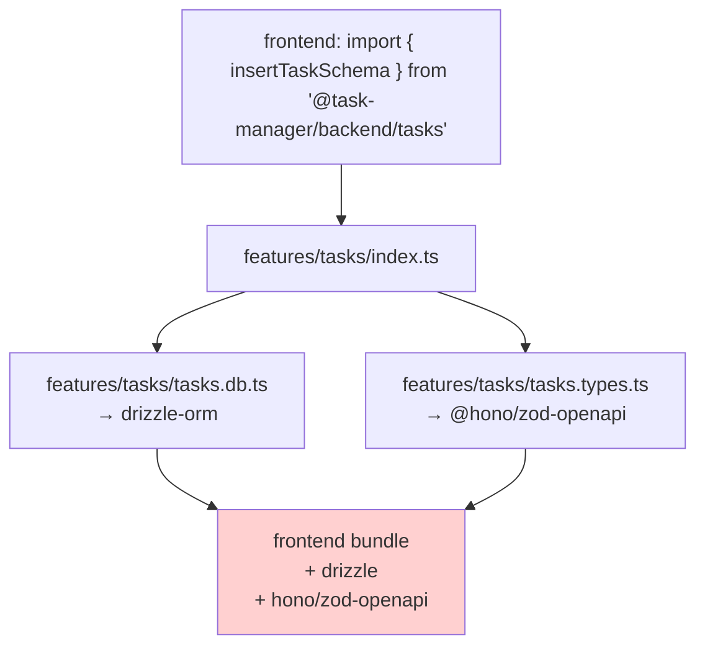

# zod + `@hono/zod-openapi` in this backend

This doc was previously flagged as outdated. The 2026-05 dep upgrade resolved the underlying issue it discussed; this rewrite captures the current accurate state. See also [`../_shared/dependency-upgrades-2026-05.md`](../_shared/dependency-upgrades-2026-05.md).

## Current import pattern (3 lanes)

| Layer | Files | Imports |
|---|---|---|
| Routes | `apps/backend/src/features/*/*.routes.ts` | `import { createRoute, z } from '@hono/zod-openapi'` |
| Types / API schemas | `apps/backend/src/features/*/*.types.ts`, `apps/backend/src/types/response.ts` | `import { z } from 'zod/v4'` + `import { extendZodWithOpenApi } from '@hono/zod-openapi'` + `extendZodWithOpenApi(z)` |
| DB schemas | `apps/backend/src/features/*/*.db.ts` | `import { z } from 'zod/v4'` (some as `type` only) |

Both `z` imports — userland `zod/v4` and the rexport from `@hono/zod-openapi` — resolve to **the same** module after the upgrade. See "Why it works" below.

## Why it works

After bumping `@hono/zod-openapi` to `1.4.0`:

- `@hono/zod-openapi` depends on `@asteasolutions/zod-to-openapi@^8.5.0`.
- `@asteasolutions/zod-to-openapi@^8.5` declares `zod` as a **peer dependency** (not a regular one).
- Bun therefore installs a **single hoisted** `node_modules/zod` and links both packages to it. No nested copy under `@asteasolutions/zod-to-openapi/node_modules/zod` exists anymore.
- `@hono/zod-openapi/dist/index.js` (line 229 in 1.4.0) calls `extendZodWithOpenApi(z)` itself at module load — this mutates `ZodType.prototype.openapi` on the single hoisted zod instance.



The mutation is idempotent — calling `extendZodWithOpenApi(z)` more than once does nothing extra. Once any code path has imported anything from `@hono/zod-openapi`, every schema in the process (regardless of which import style created it) has a working `.openapi()` method.

## The redundant calls

These four files each contain `extendZodWithOpenApi(z)` at the top:

- `apps/backend/src/features/labels/labels.types.ts`
- `apps/backend/src/features/reminders/reminders.types.ts`
- `apps/backend/src/features/tasks/tasks.types.ts`
- `apps/backend/src/features/projects/projects.types.ts`

By the time any of these files run, the mutation has already happened — every `.routes.ts` in the same feature imports `z` from `@hono/zod-openapi`, which side-effects the prototype at its own module load. So the explicit calls are dead code.

**They're harmless** (idempotent), but **dead**. A future cleanup (phase 2) can remove them and either keep the `zod/v4` import or switch to the rexported `z` — both produce identical runtime behavior.

## Frontend implication (latent)

`apps/backend/package.json` re-exports feature surfaces (e.g. `./tasks` → `apps/backend/src/features/tasks/index.ts`). Today, `apps/react19/src/features/tasks/components/task-list/TaskList.tsx` consumes them with **type-only** imports:

```ts
import type { Task } from '@task-manager/backend/tasks';
```

Type-only imports are erased at compile time — zero runtime cost, no bundle bloat. Everything is fine.

The latent issue: `apps/backend/src/features/tasks/index.ts` also re-exports **value** schemas (`insertTaskSchema`, `selectTaskSchema`, etc.). The day a frontend wants to value-import one of them (e.g. for form validation):



Both drizzle-orm and `@hono/zod-openapi` would end up in the frontend bundle. This is independent of whether `*.types.ts` uses `zod/v4` or the rexported `z` — either way, the file imports `@hono/zod-openapi`. The structural fix is to move pure schemas into a package that imports only `zod`, and apply `.openapi()` metadata in a backend-side adapter.

## Phase-2 follow-ups

Two follow-ups carry forward from this analysis:

1. **Cleanup (small)**: drop the 4 `extendZodWithOpenApi(z)` lines from `*.types.ts`. Optionally also switch the `z` import in those files to the rexport for one-line clarity — functionally identical.
2. **Restructure (bigger)**: move shareable schemas into a separate package (e.g. `packages/schemas`, or co-located in `packages/utils`) so frontends can value-import them without dragging drizzle or `@hono/zod-openapi` into the bundle. Add a thin backend-side adapter that takes each plain schema and attaches `.openapi()` metadata for the OpenAPI generator.

Both are out of scope for the dep-upgrade phase and live in phase 2 (backend code structure / zod approach).
